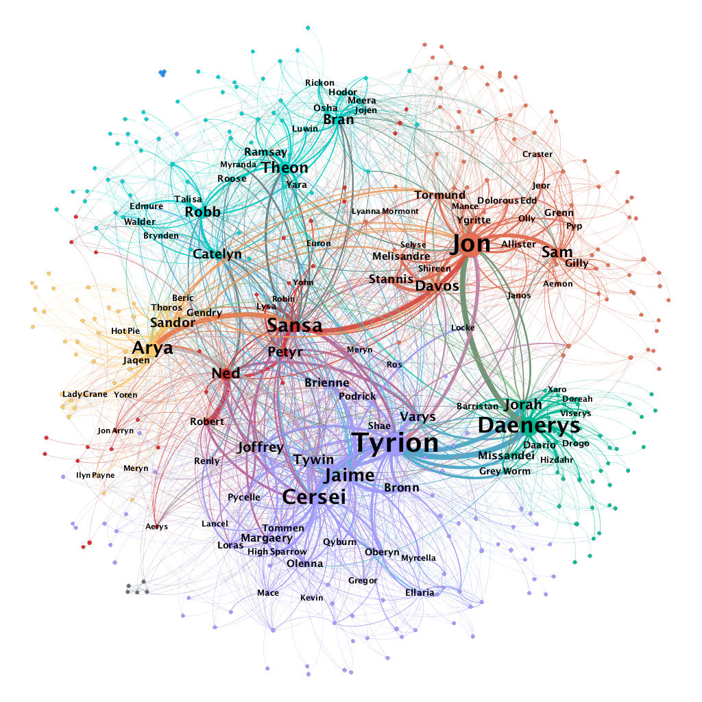
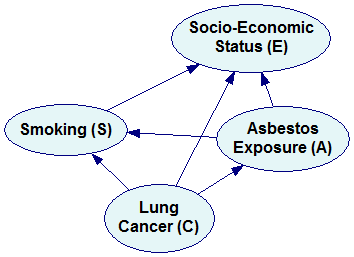

```{r setup, include=FALSE}
knitr::opts_chunk$set(echo = TRUE)
```


# Conceptos preliminares

Una **red** es una colección de objetos interconectados.

Un **grafo** es una colección de objetos (vértices o nodos) unidos por enlaces (aristas o arcos).

Los **objetos** se denominan comúnmente como actores, individuos, nodos o vértices; mientras que las **conexiones** entre ellos como enlaces, conexiones, aristas o arcos.

Las **interacciones** de las partes que constituyen un sistema conducen a **comportamientos colectivos** y **propiedades a nivel global**.

## Ejemplos

- Redes **sociales** **on-line**: e.g., [Twitter](https://allthingsgraphed.com/2014/11/02/twitter-friends-network/).

```{r, eval = TRUE, echo=FALSE, out.width="60%", fig.pos = 'H', fig.align = 'center'}

```

- Redes **laborales**: e.g., [red de colaboración entre instituciones de investigación](https://www.researchgate.net/figure/The-illustration-of-collaboration-network-between-research-institutions_fig1_343653014).


```{r, eval = TRUE, echo=FALSE, out.width="60%", fig.pos = 'H', fig.align = 'center'}

```


- Redes **biológicas**: e.g., [red de proteínas](https://www.genengnews.com/insights/protein-protein-interactions-get-a-new-groove-on/).

```{r, eval = TRUE, echo=FALSE, out.width="60%", fig.pos = 'H', fig.align = 'center'}

```


- Redes de **personajes**: e.g., [*Game of Thrones*](https://networkofthrones.wordpress.com/).

```{r, eval = TRUE, echo=FALSE, out.width="60%", fig.pos = 'H', fig.align = 'center'}

```


Y **muchas más**: redes de **información**, redes de **contagio**, redes de **transporte**, redes de **comercio**, redes de **corrupción**, etc.


## Datos relacionales

Los **datos relacionales** están constituidos por una colección de **objetos**, sus **atributos** y un conjunto de **relaciones** observadas entre ellos.

La presencia de **variables diádicas** (medidas sobre pares de individuos o díadas) es la característica distintiva de los datos relacionales.

## Objetivos

Almacenar, gestionar, caracterizar, visualizar y modelar datos relacionales:

- **Teoría de grafos**.
- **Modelos estadísticos**.
- **Herramientas computacionales**.

# Tipos de redes

## Redes no dirigidas y dirigidas

Una relación **no dirigida** (simétrica) tiene uno y solo un valor por díada. 

Una relación **dirigida** (asimétrica) tiene dos valores por díada, i.e., un valor para cada miembro de la pareja. 

Se dice que una red es una **red no dirigida** (grafo) si todas las relaciones en ella no están dirigidas, y se denomina **red dirigida** (dígrafo) en caso contrario.

Ejemplos de relaciones **no dirigidas**:

- Amistades de una red social *on-line*.
- Cantidad de tiempo que personas pasan juntas.

```{r, eval = TRUE, echo=FALSE, out.width="50%", fig.pos = 'H', fig.align = 'center'}

```

Ejemplos de relaciones **dirigidas**:

- Amistades auto-informadas.
- Número de correos electrónicos enviados entre compañeros de trabajo.

```{r, eval = TRUE, echo=FALSE, out.width="50%", fig.pos = 'H', fig.align = 'center'}

```

## Redes binarias y ponderadas

Una relación **binaria** (dicotómica) únicamente asume dos valores, ausencia o presencia de la relación. 

Una relación **ponderada** (numérica) toma más de dos valores para caracterizar las relaciones entre las díadas.

Ejemplos de relaciones **binarias**:

- Presencia de un conflicto militar entre países.
- Presencia de una alianza estratégica entre compañías. 

Ejemplos de relaciones **ponderadas**:

- Número de veces que congresistas apoyan un proyecto de ley juntos.
- Distancia geográfica entre ciudades.


# Otros tipos de redes

## Redes neuronales

Una **red neuronal** es un **modelo computacional** con varias **capas de nodos**, cuyo comportamiento está determinado por la forma en que se conectan los nodos y la ponderación de las conexiones. 

Usualmente se utilizan para **tareas de identificación complejas**, como el reconocimiento facial, el reconocimiento de voz y la traducción de textos.

```{r, eval = TRUE, echo=FALSE, out.width="50%", fig.pos = 'H', fig.align = 'center'}

```

Ver por ejemplo:

- Ghatak, A. (2019). *Deep learning with R*. Springer.
- [¿Pero qué "es" una Red neuronal?](https://www.youtube.com/watch?v=aircAruvnKk&t=21s&ab_channel=3Blue1Brown) de **3Blue1Brown**.


## Redes Bayesianas
            
Las **redes Bayesianas** son una clase de **modelos gráficos** que permiten una representación de las **dependencias probabilísticas** entre un conjunto dado de variables aleatorias por medio de un *gráfico acíclico dirigido* (DAG), donde cada nodo corresponde a una variable aleatoria.

```{r, eval = TRUE, echo=FALSE, out.width="33%", fig.pos = 'H', fig.align = 'center'}

```

Ver por ejemplo:

- Scutari, M. & Denis, J. B. (2021). *Bayesian networks: with examples in R*. CRC press.
- [Bayesian Networks](https://www.youtube.com/watch?v=TuGDMj43ehw&ab_channel=BertHuang) de **Bert Huang**. 


# Software

Los paquetes [igraph](https://igraph.org/) (R y Python) y [NetworkX](https://networkx.org/) (Python) proporcionan herramientas versátiles para la visualización y el análisis de redes. 

Más alternativas:

- **R**: statnet, network, sna, tidygrap, ggnet2, ggraph, networkD3.
- **Python**: Graph-tool, Networkit.


# Fuentes de datos

Entre muchos otros repositorios:

- [Duke Network Analysis Center](https://sites.duke.edu/dnac/resources/datasets/).
- [Stanford Network Analysis Project](https://snap.stanford.edu/).
- [Awesome Public Datasets](https://github.com/awesomedata/awesome-public-datasets#socialnetworks).
- [LINQS](https://linqs.org/).
- [Mark Newman](http://www-personal.umich.edu/~mejn/netdata/).
- [Katya Ognyanova](https://kateto.net/).


# Referencias

```{r, eval = TRUE, echo=FALSE, out.width="25%", fig.pos = 'H', fig.align = 'center'}
knitr::include_graphics("01_cover_KC.jpg")
```


```{r, eval = TRUE, echo=FALSE, out.width="25%", fig.pos = 'H', fig.align = 'center'}

```


```{r, eval = TRUE, echo=FALSE, out.width="25%", fig.pos = 'H', fig.align = 'center'}
knitr::include_graphics("01_cover_Menczer.jpg")
```


```{r, eval = TRUE, echo=FALSE, out.width="25%", fig.pos = 'H', fig.align = 'center'}
knitr::include_graphics("01_cover_AK.jpg")
```


```{r, eval = TRUE, echo=FALSE, out.width="25%", fig.pos = 'H', fig.align = 'center'}
knitr::include_graphics("01_cover_Newman.jpg")
```