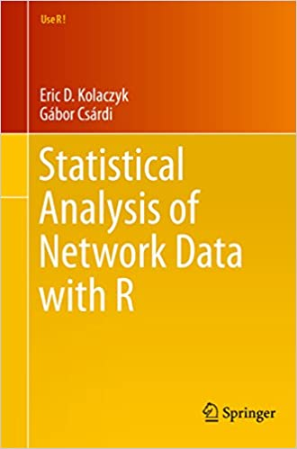

```{r setup, include=FALSE}
knitr::opts_chunk$set(echo = TRUE)
```

# Introducción

**Conformación**, **almacenamiento** y **gestión** de datos relacionales:

- Variables **diádicas**.
- Variables **nodales**.
- Variables **derivadas** (e.g., indicadoras de grupos).

Un **grafo** por sí solo (una colección de vértices y aristas) suele ser insuficiente para representar todos los atributos una red.

La **decoración** de un grafo corresponde a la **conjunción de vértices y aristas con otras variables** de interés (atributos).

La **teoría de grafos** es fundamental para analizar redes sociales.


# Grafos

Un **grafo** $G = (V, E)$ es una estructura que consiste de un conjunto de **vértices** (nodos) $V$ y de un conjunto de **aristas** (enlaces) $E$. Los elementos de $E$ son parejas de la forma $e=\{u,v\}$, con $u,v\in V$. 

El **número de vértices** $|V|$ y el **número de aristas** $|E|$ se conocen como el **orden** y el **tamaño** del grafo, respectivamente.

Los **vértices** del grafo **se enumeran** con los números enteros $1,\ldots,n$ o $0,\ldots,n-1$, donde $n = |V|$.


## Grafos y digrafos

Un grafo para el que cada arista $\{u,v\}\in E$ es tal que $\{u,v\} \not\equiv \{v,u\}$, para todo $u,v\in V$ se denomina **grafo dirigido** o **digrafo**. De lo contrario se llama **grafo no dirigido** o simplemente **grafo**. 

```{r, eval = TRUE, echo=FALSE, out.width="40%", fig.pos = 'H', fig.align = 'center'}

```


# Multigrafos

Un **multigrafo** es aquel grafo que permite **múltiples aristas** entre el mismo par de vértices y aristas de un vértice a sí mismo. 

Un grafo que no es un multigrafo se denomina **grafo simple**.

Paquete [multinet](https://uu.diva-portal.org/smash/get/diva2:1577343/FULLTEXT01.pdf) en R.

```{r, eval = TRUE, echo=FALSE, out.width="70%", fig.pos = 'H', fig.align = 'center'}
knitr::include_graphics("02_multigraph.png")
```


## Ejemplo: red binaria no dirigida

```{r}
# install.packages("igraph")
suppressMessages(suppressWarnings(library(igraph)))
# red binaria no dirigida
g <- graph_from_literal(1-2, 1-3, 2-3, 2-4, 3-5, 4-5, 4-6, 4-7, 5-6, 6-7)
# otra manera
# g <- graph(edges = c(1,2, 1,3, 2,3, 2,4, 3,5, 4,5, 4,6, 4,7, 5,6, 6,7), directed = FALSE)
```


```{r}
# clase de objeto
class(g)
# identificador
graph_id(g)
# vértices
V(g)
# orden
vcount(g)
# aristas
E(g)
# tamaño
ecount(g)
# aristas (otro formato)
print_all(g)
# ponderada?
is_weighted(g)
# simple?
is_simple(g)
```


```{r, fig.height = 5, fig.width = 5, fig.align = 'center'}
# visualización
set.seed(123)
plot(g, main = "Red binaria no dirigida")
```


## Ejmplo: red ponderada no dirigida

```{r}
# red ponderada no dirigida
wg <- g
E(wg)$weight <- round(runif(n = ecount(wg)), 3)
# pesos
E(wg)$weight
# ponderada?
is_weighted(wg)
```


```{r, fig.height = 5, fig.width = 5, fig.align = 'center'}
# visualización
set.seed(123)
plot(wg, edge.width = 5*E(wg)$weight, main = "Red ponderada no dirigida")
```


## Ejemplo: red binaria dirigida

```{r}
# red binaria dirigida
dg <- graph_from_literal(1-+2, 1-+3, 2++3)
```


```{r}
# aristas
E(dg)
```


```{r}
# etiquetas
V(dg)$name <- c("Juan", "Maria", "Pedro")
# agregar 'sexo' como atributo
V(dg)$sexo <- c("M","F","M")
# aristas
E(dg)
```


```{r, fig.height = 5, fig.width = 5, fig.align = 'center'}
# visualización
set.seed(123)
plot(dg, vertex.size = 35, main = "Red binaria dirigida")
```


## Ejemplo: multigrafo

```{r}
# multigrafo
mg <- g + edge(c(1,1), c(1,2), c(1,3))
print_all(mg)
# simple?
is_simple(mg)
# simplificación
E(mg)$weight <- 1
wg2 <- simplify(mg)
```


```{r}
# simple?
is_simple(wg2)
# ponderada?
is_weighted(wg2)
# aristas
# se pierden los bucles
E(wg2)
# pesos
E(wg2)$weight
```


# Estructuras de datos

Generalmente los grafos **no se definen manualmente** ya que en la práctica la mayoría de las redes son **grandes**.

Los datos para construir un grafo comúnmente se almacenarán en un **archivo de datos** (.txt, .csc, .dat, etc.). 

## Matriz de adyacencia

La **matriz de adyacencia** o **socio-matriz** $\mathbf{Y} = [y_{i,j}]$ asociada con un grafo $G=(V,E)$ de orden $n$ es una **matriz binaria** de $n\times n$ tal que $y_{i,j} = 1$ si $\{i,j\} \in E$ y $y_{i,j} = 0$ en otro caso.

La **diagonal principal** de una matriz de adyacencia está llena de **ceros estructurales**.

La matriz de adyacencia de un **grafo no dirigido** es **necesariamente simétrica**. 

La matriz de adyacencia de un **grafo dirigido**    es **posiblemente asimétrica**.


## Ejemplo: red binaria no dirigida

```{r}
# red binaria no dirigida
g <- graph_from_literal(1-2, 1-3, 2-3, 2-4, 3-5, 4-5, 4-6, 4-7, 5-6, 6-7)
```


```{r, fig.height = 5, fig.width = 5, fig.align = 'center'}
# visualización
set.seed(123)
plot(g, main = "Red binaria no dirigida")
```


```{r}
# matriz de adyacencia
A <- get.adjacency(g)
# clase de objeto
class(A)
print(A)
# formato 'matrix array'
Y <- get.adjacency(g, sparse = F)
# clase de objeto
class(Y)
# simétrica?
isSymmetric(Y)
print(Y)
# versión vectorizada exhaustiva
(yvec1 <- Y[lower.tri(Y)])
# versión vectorizada indexada
(yvec2 <- which(yvec1 == 1))
```


## Matriz de aristas

Una **matriz de aristas** es un **arreglo de dos columnas** conformado por todos los **pares de vértices** que están **unidos** por una arista.

## Ejemplo: red binaria no dirigida (cont.)

```{r}
# matriz de aristas
n <- dim(Y)[1]
A <- NULL
for (i in 1:(n-1)) 
  for (j in (i+1):n) 
    if (Y[i,j] == 1) 
      A <- rbind(A, c(i,j))
```


```{r}
# clase de objeto
class(A)
print(A)
```


## Ejemplo: Trabajo colaborativo

Red de **relaciones de trabajo colaborativo** entre miembros de una firma de abogados (SG&R). 

Estos datos fueron recolectados para **estudiar la cooperación** entre los actores de una organización.

$y_{i,j} = 1$ si los individuos $i$ y $j$ han trabajado juntos en al menos un caso y $y_{i,j} = 0$ en otro caso.

Una descripción completa de los datos se puede encontrar [aquí](https://www.stats.ox.ac.uk/~snijders/siena/Lazega_lawyers_data.htm).

Lazega, E. (2001). **The collegial phenomenon: The social mechanisms of cooperation among peers in a corporate law partnership**. Oxford University Press on Demand.


```{r}
# install.packages("sand")
suppressMessages(suppressWarnings(library(sand)))
```


```{r}
# datos
head(elist.lazega)
# clase de objeto
class(elist.lazega)
# dimensión
dim(elist.lazega)
```


```{r}
# grafo
g_lazega <- graph_from_data_frame(d = elist.lazega, directed = "F", vertices = v.attr.lazega)
# ver también 'graph_from_edgelist' y 'graph_from_adjacency_matrix'}
V(g_lazega)$name <- 1:vcount(g_lazega)
```


```{r}
# matriz de adyacencia
Y_lazega <- get.adjacency(g_lazega, sparse = F)
```


```{r}
# simple?
is_simple(g_lazega)
# ponderado?
is_weighted(g_lazega)
# orden
vcount(g_lazega)
# tamaño
ecount(g_lazega)
```


```{r, fig.height = 7, fig.width = 14, fig.align='center'}
# visualización
par(mfrow = c(1,2))
# grafo
set.seed(123)
plot(g_lazega, vertex.size = 9, vertex.label.color = "black", vertex.color = NA, vertex.frame.color = "black", edge.color = "blue4", main = "Trabajo colaborativo")
# matriz de adyacencia
corrplot::corrplot(corr = Y_lazega, method = "color", tl.col = "black", addgrid.col = "gray90", cl.pos = "n")
```


# Referencias

```{r, eval = TRUE, echo=FALSE, out.width="25%", fig.pos = 'H', fig.align = 'center'}

```


```{r, eval = TRUE, echo=FALSE, out.width="25%", fig.pos = 'H', fig.align = 'center'}
knitr::include_graphics("01_cover_Luke.jpg")
```


```{r, eval = TRUE, echo=FALSE, out.width="25%", fig.pos = 'H', fig.align = 'center'}
knitr::include_graphics("01_cover_Menczer.jpg")
```


```{r, eval = TRUE, echo=FALSE, out.width="25%", fig.pos = 'H', fig.align = 'center'}
knitr::include_graphics("01_cover_AK.jpg")
```


```{r, eval = TRUE, echo=FALSE, out.width="25%", fig.pos = 'H', fig.align = 'center'}
knitr::include_graphics("01_cover_Newman.jpg")
```

