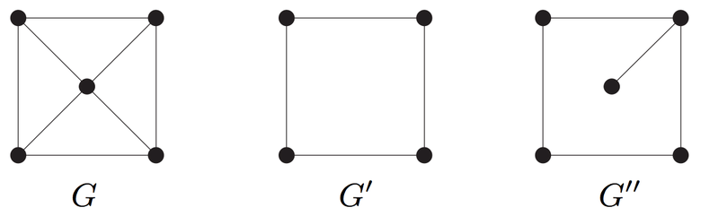
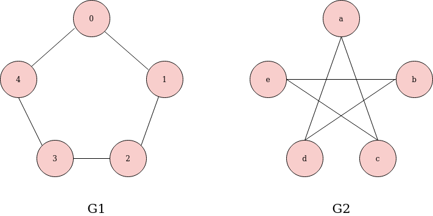
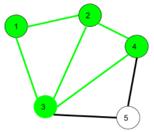
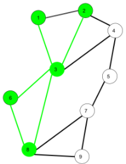
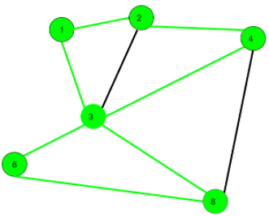
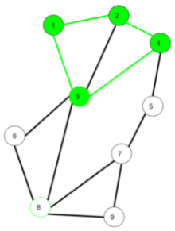
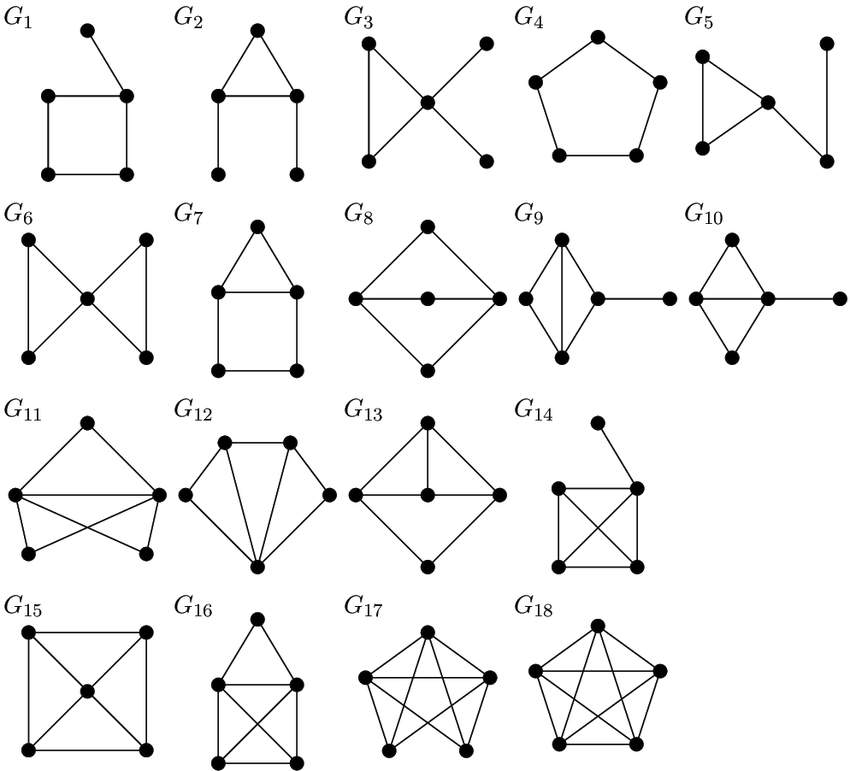

```{r setup, include=FALSE}
knitr::opts_chunk$set(echo = TRUE)
```


# Grafos y subgrafos

## Grafos {-}

Un **grafo** $G = (V, E)$ es una estructura que consiste de un conjunto de **vértices** (nodos) $V$ y de un conjunto de **aristas** (enlaces) $E$, donde los elementos de $E$ son parejas de la forma $e=\{u,v\}$, con $u,v\in V$. 

## Subgrafos {-}

Un grafo $G'=(V',E')$ es un **subgrafo** de $G=(V,E)$ si $V'\subset V$ y $E'\subset E$.

```{r, eval = TRUE, echo=FALSE, out.width="70%", fig.pos = 'H', fig.align = 'center'}

```


# Grafos isomorfos

Dos grafos que son **equivalentes estructuralmente** (a pesar de las etiquetas de los vértices) se denominan **isomorfos**. 

Dos grafos $G_1 = (V_1, E_1)$ y $G_2 = (V_2, E_2)$ son **isomorfos**, lo que se escribe $G_1 \equiv G_2$, si existe una biyección $\varphi:V_1\longrightarrow V_2$ tal que $\{u,v\}\in E_1$ si y solo si $\{\varphi(u),\varphi(v)\}\in E_2$.

```{r, eval = TRUE, echo=FALSE, out.width="60%", fig.pos = 'H', fig.align = 'center'}
knitr::include_graphics("02_iso0.jpg")
```

Si $G_1 \equiv G_2$, entonces $|V_1| = |V_2|$ y $|E_1| = |E_2|$.

Si $|V_1| \neq |V_2|$ o $|E_1| \neq |E_2|$, entonces $G_1 \not\equiv G_2$.

Si $G_1 \equiv G_2$ y $\{u,v\}\notin E_1$, entonces $\{\varphi(u),\varphi(v)\}\notin E_2$.

## Ejemplo

¿$G_1$ y $G_2$ son isomorfos?

```{r, eval = TRUE, echo=FALSE, out.width="75%", fig.pos = 'H', fig.align = 'center'}

```


```{r}
suppressMessages(suppressWarnings(library(igraph)))
# grafos
g1 <- graph_from_literal(0-1, 1-2, 2-3, 3-4, 4-0)
g2 <- graph_from_literal(a-c, a-d, b-d, b-e, c-e)
```


```{r}
# isomorfos?
# ver ayuda acerca de 'method'
isomorphic(g1, g2, method = "auto")
```


```{r, fig.height = 5, fig.width = 10, fig.align='center'}
# visualización
set.seed(123)
par(mfrow = c(1,2))
plot(g1, vertex.size = 15, main = "Grafo 1")
plot(g2, vertex.size = 15, main = "Grafo 2")
```


# Adyacencia

## Vértives adyacentes {-}

Se dice que dos vértices $u, v \in V$ son **adyacentes** (*adjacent*), lo que se denota con $u\sim v$, si $u$ y $v$ están conectados por alguna arista de $E$.


## Vértives asilados {-}

Un vértice $v\in V$ se llama **asilado** (*isolated*) si $v\not\sim u$ para todo $u\in V$.

Un grafo se puede almacenar por medio de una matriz de aristas y una lista de vértices aislados. 


## Vértices incidentes {-}

Un vértice $v \in V$ es **incidente** (*incident*) en una arista $e\in E$ si $e = \{v,u\}$ para algún $u\in V$. 

## Grado {-}

El **grado** (*degree*) del vértice $v\in V$ se define como el número de aristas incidentes en $v$.

Para dígrafos, el **grado de entrada** (*in-degree*) y el **grado de salida** (*out-degree*) del vértice $v\in V$ se definen como el número de aristas que apuntan hacia dentro y hacia fuera de $v$, respectivamente.


## Ejemplo

```{r, fig.align='center'}
# red no dirigida
g <- graph_from_literal(1-2, 1-3, 2-3, 2-4, 3-5, 4-5, 4-6, 4-7, 5-6, 6-7)
```


```{r, fig.height = 5, fig.width = 5, fig.align = 'center'}
# visualización
set.seed(123)
plot(g)
```


```{r}
# vecinos del vértice 1
neighbors(graph = g, v = 1)
```


```{r}
# grados
degree(graph = g)
```


## Ejemplo

```{r, fig.align='center'}
# red dirigida
dg <- graph_from_literal(1-+2, 1-+3, 2++3)
```


```{r, fig.height = 5, fig.width = 5, fig.align = 'center'}
# visualización
set.seed(123)
plot(dg)
```


```{r}
# grado de entrada
degree(graph = dg, mode = "in")
# grado de salida
degree(graph = dg, mode = "out")
```


# Movimiento

## Caminata  {-}

Una **caminata** (*walk*) de $v_0$ a $v_\ell$ de longitud $\ell$ es una secuencia alternante $\{v_0,e_1,v_1,e_2,v_2,\ldots,v_{\ell-1},e_\ell,v_\ell\}$ en la que los puntos extremos de $e_i$ son $\{v_{i-1}, v_i\}$, con $i=1,\ldots,\ell$ (se pueden repetir vértices y aristas). 

- $1\rightarrow 2\rightarrow 3\rightarrow 4\rightarrow 3\,$              es una **caminata abierta**. 
- $1\rightarrow 2\rightarrow 3\rightarrow 4\rightarrow 3\rightarrow 1\,$ es una **caminata cerrada**.

```{r, eval = TRUE, echo=FALSE, out.width="15%", fig.pos = 'H', fig.align = 'center'}

```

## Sendero {-}

Un **sendero** (*trail*) es una caminata abierta sin aristas repetidas (se pueden repetir vértices).

- $1\rightarrow 3\rightarrow 8\rightarrow 6\rightarrow 3\rightarrow 2\,$ es un **sendero**. 

```{r, eval = TRUE, echo=FALSE, out.width="18%", fig.pos = 'H', fig.align = 'center'}

```


## Circuito {-}

Un **circuito** (*circuit*) es una caminata cerrada sin aristas repetidas (se pueden repetir vértices). 

- $1\rightarrow 2\rightarrow 4\rightarrow 3\rightarrow 6\rightarrow 8\rightarrow 3\rightarrow 1\,$ es un **circuito**.

```{r, eval = TRUE, echo=FALSE, out.width="22%", fig.pos = 'H', fig.align = 'center'}

```


## Ciclo {-}

Un **ciclo** (*cycle*) es una caminata cerrada con al menos tres aristas no repetidas y vértices intermedios distintos.

- $1\rightarrow 2\rightarrow 4\rightarrow 3\rightarrow 1\,$ es un ciclo. 

```{r, eval = TRUE, echo=FALSE, out.width="17%", fig.pos = 'H', fig.align = 'center'}

```

Los grafos que no contienen ciclos se denominan **acíclicos** (*acycle*).


# Conectividad

Se dice que un vértice $v$ es **accesible** (*reachable*) desde otro vértice $u$ si existe una caminata desde $u$ hasta $v$. 

Se dice que un grafo está **conectado** (*connected*) si cada vértice es accesible desde todos los demás. 


## Ejemplo: grafos conectados con 5 vértices

```{r, eval = TRUE, echo=FALSE, out.width="50%", fig.pos = 'H', fig.align = 'center'}

```


Una **componente** (*component*) de un grafo es un subgrafo conectado maximalmente, i.e., un subgrafo al que añadirle cualquier otro vértice arruina la conectividad.


## Ejemplo

```{r}
# red no dirigida
g <- graph_from_literal(1-7, 2-7, 2-4, 3-6, 4-7, 5-11, 6-12, 7-8, 7-9, 7-10)
```


```{r, fig.height = 5, fig.width = 5, fig.align = 'center'}
# visualización
set.seed(123)
plot(g)
```


```{r}
# conectado?
is_connected(g)
```


```{r}
# componentes
clusters(g)
```


Un digrafo está **conectado débilmente**  (*weakly connected*)   si el grafo subyacente (resultado de remover la direccionalidad) está conectado.

Un digrafo está **conectado fuertemente** (*strongly connected*) si cada vértice es accesible desde todos los demás mediante una caminata dirigida.


## Ejemplo

```{r, fig.align='center'}
# red dirigida
dg <- graph_from_literal(1-+2, 1-+3, 2++3)
```


```{r, fig.height = 5, fig.width = 5, fig.align = 'center'}
# visualización
set.seed(123)
plot(dg)
```


```{r}
# conectado débilmente?
is_connected(graph = dg, mode = "weak")
```


```{r}
# conectado fuertemente?
is_connected(graph = dg, mode = "strong")
```


# Distancia

La **distancia geodésica** entre dos vértices de un grafo es la longitud de la caminata más corta entre los vértices. 

La distancia se define como infinito si no existen caminatas entre los vértices.

El valor de la distancia más grande de un grafo se llama **diámetro** del grafo.

La **distancia geodésica promedio** es una medida del grado de separación de los vértices.

## Ejemplo

```{r, fig.align='center'}
# red no dirigida
g <- graph_from_literal(1-2, 1-3, 2-3, 2-4, 3-5, 4-5, 4-6, 4-7, 5-6, 6-7)
```


```{r, fig.height = 5, fig.width = 5, fig.align = 'center'}
# visualización
set.seed(123)
plot(g)
```


```{r}
# distancia
distances(graph = g, v = 1, to = 6)
```


```{r}
# caminata
shortest_paths(graph = g, from = 1, to = 6)$vpath
```


```{r}
# caminatas
all_shortest_paths(graph = g, from = 1, to = 6)$res
```


```{r}
# distancias
(D <- distances(graph = g, v = V(g), to = V(g)))
```


```{r}
# diámetro
diameter(g)
```


```{r}
# diámetro (otra manera)
max(D[lower.tri(D)])
```


```{r}
# sendero del diámetro
(d <- get_diameter(g))
```


```{r, fig.height = 5, fig.width = 5, fig.align = 'center'}
# visualización del diámetro
V(g)$color <- "white"
E(g)$color <- "grey"
E(g)$width <- 1
V(g)[d]$color <- "royalblue"
E(g, path = d)$color <- "royalblue"
E(g, path = d)$width <- 2
set.seed(123)
plot(g)
```


```{r}
# distancia geodésica promedio
mean_distance(g)
```


```{r}
# distancia geodésica promedio (otra manera)
mean(D[lower.tri(D)])
```


```{r}
# distribución de las distancias
distance_table(g)
```


```{r, fig.align='center'}
# visualización
senderos <- distance_table(g)$res
names(senderos) <- 1:length(senderos)
barplot(prop.table(senderos), xlab = "Distancia geodésica", ylab = "F. Relativa", border = "grey", col = "grey", main = "Distribución de distancias geodésicas")
```


# Referencias

```{r, eval = TRUE, echo=FALSE, out.width="25%", fig.pos = 'H', fig.align = 'center'}
knitr::include_graphics("01_cover_KC.jpg")
```


```{r, eval = TRUE, echo=FALSE, out.width="25%", fig.pos = 'H', fig.align = 'center'}
knitr::include_graphics("01_cover_Luke.jpg")
```


```{r, eval = TRUE, echo=FALSE, out.width="25%", fig.pos = 'H', fig.align = 'center'}
knitr::include_graphics("01_cover_Menczer.jpg")
```


```{r, eval = TRUE, echo=FALSE, out.width="25%", fig.pos = 'H', fig.align = 'center'}
knitr::include_graphics("01_cover_AK.jpg")
```


```{r, eval = TRUE, echo=FALSE, out.width="25%", fig.pos = 'H', fig.align = 'center'}
knitr::include_graphics("01_cover_Newman.jpg")
```
