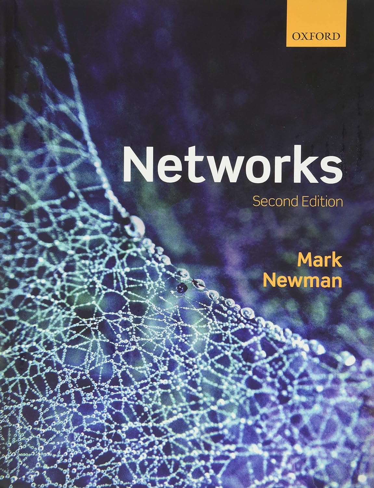

```{r setup, include=FALSE}
knitr::opts_chunk$set(echo = TRUE)
```

# Introducción

Se quiere caracterizar aspectos fundamentales de la **estructura social** de una red representada por medio de un grafo $G=(V,E)$:

- **Importancia de individuos**.
- Dinámicas sociales.
- Flujo de la información.
- Formación de comunidades.


# Grado y fuerza

El **grado** (*degree*) $d_v$ de un vértice $v\in V$ se define como $d_v = |\left\{\{v,u\}\in E:u\in V \right\}|$, i.e., $d_v$ corresponde al número de aristas incidentes en $v$. 

A partir de la **matriz de adyacencia** $\mathbf{Y}=[y_{i,j}]$ se tiene que el grado del individuo $i$ se puede calcular mediante
$$
d_i = \sum_{i:i\neq j} y_{i,j} = \sum_{j:j \neq i} y_{i,j}\,,\qquad \text{para}\,\,i=1,\ldots,n\,.
$$

El grado de un vértice es la combinación de la **sociabilidad** y la **popularidad**.

¿Cómo se adaptan estos conceptos en el caso de los **digrafos**?

En redes ponderadas, la **fuerza** (*strength*) $s_v$ de un vértice $v\in V$ se define como 
$$
s_v = \sum_{u\in V:\{v,u\}\in E} w_{\{v,u\}}\,,
$$
i.e., la suma de los pesos de las aristas incidentes en $v$. 


## Ejemplo: Juego de Tronos (*Game of Thrones*)

Red de **interacción de personajes** de la temporada 1 de la serie de HBO Juego de Tronos.

Esto datos fueron recolectados para **estudiar la dinámica** de los Siete Reinos de Juego de Tronos.

Los personajes están conectados mediante aristas ponderadas por el **número de interacciones** de los personajes.

Una descripción completa de los datos se puede encontrar [aquí](https://networkofthrones.wordpress.com/the-series/season-1/).

Disponible este [enlace](https://github.com/mathbeveridge/gameofthrones?tab=readme-ov-file) de GitHub.

```{r}
suppressMessages(suppressWarnings(library(igraph)))
```


```{r}
# datos
setwd("C:/Users/User/Dropbox/UN/networks/")
dat_nodes <- read.csv("got-s1-nodes.csv")
dat_edges <- read.csv("got-s1-edges.csv")
```


```{r}
# grafo
got <- graph_from_data_frame(d = dat_edges[,c(1,2)], vertices = dat_nodes$Id, directed = "F") 
E(got)$weight <- dat_edges$Weight
```


```{r}
# orden
vcount(got)
# tamaño
ecount(got)
# dirigida?
is_directed(got)
# ponderada?
is_weighted(got)
```


```{r}
# matriz de adyacencia
Y <- as_adjacency_matrix(got, sparse = F)
# grado
head(
  cbind(
    degree(graph = got), 
    apply(X = Y, MARGIN = 1, FUN = sum), 
    apply(X = Y, MARGIN = 2, FUN = sum)), n = 5)
```


```{r}
# grado
d <- degree(graph = got)
head(sort(d, decreasing = T), n = 10)
```

```{r, eval = TRUE, echo=FALSE, out.width="70%", fig.pos = 'H', fig.align = 'center', fig.cap = "Top 10 de Juego de tronos (temporada 1) de acuerdo con el grado."}

```


```{r}
# fuerza
wd <- strength(got)
head(sort(wd, decreasing = T), n = 10)
```


```{r, eval = TRUE, echo=FALSE, out.width="70%", fig.pos = 'H', fig.align = 'center', fig.cap = "Top 10 de Juego de tronos (temporada 1) de acuerdo con la fuerza."}

```


```{r}
# diseño
set.seed(123)
l <- layout_with_dh(got)
```


```{r, fig.width=14, fig.height=7, fig.align='center'}
# visualización
par(mfrow = c(1,2), mar = c(4, 3, 3, 1))
# usando el grado
plot(got, layout = l, vertex.size = 1.5*sqrt(d), vertex.label = NA, vertex.color = adjustcolor("royalblue",0.2), vertex.frame.color = "royalblue", edge.color = adjustcolor("gray",0.4))
title(sub = "Grado", line = -1)
# usando la fuerza
plot(got, layout = l, vertex.size = 0.3*sqrt(wd), vertex.label = NA, vertex.color = adjustcolor("royalblue",0.2), vertex.frame.color = "royalblue", edge.color = adjustcolor("gray",0.4))
title(sub = "Fuerza", line = -1)
title(main = "Juego de Tronos: Temporada 1 ", outer = T, line = -2)
```

# Distribución del grado

La **distribución del grado** (*degree distribución*) de $G$ es la colección de frecuencia relativas $f_0, f_1,\ldots$, donde
$$
f_d = \frac{|\{v\in V:d_v = d\}|}{|V|}\,,\qquad \text{para}\,\,d=0,1,\ldots\,,
$$
i.e., la fracción de vértices en $V$ tales que $d_v = d$.

La **distribución de fuerza** (*strength distribution*) se define de manera análoga.


## Ejemplo: Interacciones sociales

Red de **interacciones sociales** entre los miembros de un club de karate.

Estos datos fueron recolectados para **estudiar la fragmentación** que sufrió el club en dos clubes diferentes debido a una disputa entre el director y el administrador.

$y_{i,j} = 1$ si los miembros $i$ y $j$ tuvieron una **interacción social** en el club y $y_{i,j} = 0$ en otro caso.

Una descripción completa de los datos se puede encontrar [aquí](https://rdrr.io/cran/igraphdata/man/karate.html).

Disponible en el paquete `igraphdata` de R.

Zachary, W. W. (1977). **An information flow model for conflict and fission in small groups**. Journal of anthropological research, 33(4), 452-473.

```{r}
# install.packages("igraphdata")
suppressMessages(suppressWarnings(library(igraphdata)))
# data
data(karate)
karate <- upgrade_graph(karate)
# la representación de datos internos a veces cambia entre versiones
```


```{r}
# orden
vcount(karate)
# tamaño
ecount(karate)
# dirigida?
is_directed(karate)
# ponderada?
is_weighted(karate)
```


```{r, fig.height = 8, fig.width = 8, fig.align='center'}
# visualización
par(mar = c(4, 3, 3, 1))
set.seed(123)
plot(karate, layout = layout_with_dh, vertex.size = 10, vertex.frame.color = "black", vertex.label.color = "black", main = "Interacciones sociales")
```


```{r}
# orden 
(n <- vcount(karate))
# grado
(d <- degree(graph = karate))
```


```{r, fig.height = 6, fig.width = 12, fig.align='center'}
# visualización
par(mfrow = c(1,2))
plot(table(factor(d, levels = 0:n))/n, type = "h", lwd = 5, ylim = c(0,0.5), xlab = "Grado", ylab = "Densidad", main = "", xaxt = "n", col = "gray50")
axis(side = 1, at = seq(from = 0, to = 35, by = 5))
plot(NA, NA, type = "n", xlim = c(0,35), ylim = c(0,0.5), xlab = "Grado", ylab = "Densidad", main = "")
hist(d, freq = F, col = "gray90", border = "gray50", add = T)
title(main = "Distribución del grado", outer = T, line = -2)
```

Hay tres grupos distintos de vértices. Los dos vértices más conectados corresponden a los actores 1 y 34, que representan al instructor y al administrador (ellos fueron quienes finalmente dividieron el club). El siguiente conjunto de vértices consta de los actores 2, 3, y 33, que son los más cercanos a los actores 1 y 34.


## Ley de potencias

En algunas redes se tiene que una gran porción de vértices tiene grado bajo y una pequeña fracción tiene grado alto. Esta pequeña fracción de vértices se conoce como **centros** (*hubs*).

En estos casos la distribución del grado tiene una **cola larga a la derecha**. Esto se traduce en un **decaimiento aproximadamente lineal** en la frecuencia logarítmica en función del grado logarítmico. 

La **distribución de la ley de potencias** (*power law distribution*) señala que la distribución del grado $d$ es de la forma
$$
f_d = \mathrm{c}\,d^{-\alpha}\,,\qquad \mathrm{c}>0\,,\qquad \alpha>1\,,
$$
lo que en escala log corresponde a
$$
\log f_d = \log \mathrm{c} - \alpha\log d\,.
$$
$\mathrm{c}$ se denomina constante de normalización y $\alpha$ exponente de la ley de potencias (similar a la **distribución de Pareto**).

Las redes que satisfacen este tipo de distribución del grado se denominan **libres de escala** (*scale free*) dado que
$$
f_{a\,d} =  \mathrm{c}\, (a\,d)^{-\alpha} = a^{-\alpha}\,f_d\,.
$$
En una red libre de escala, algunos nodos están altamente conectados, es decir, poseen un gran número de enlaces a otros nodos, aunque el grado de conexión de casi todos los nodos es bastante bajo.


## Ejemplo: Interacciones proteína-proteína

Red de **interacción de proteínas** de levadura. 

Las interacciones proteína-proteína prometen revelar aspectos del sistema regulatorio que subyace a la función celular.

Los nodos corresponden a proteínas y solo se consideran aquellas interacciones que tienen una confianza "moderada" y "alta". 

Una descripción completa de los datos se puede encontrar [aquí](http://www.nature.com/nature/journal/v417/n6887/suppinfo/nature750.html).

Disponible en el paquete `igraphdata` de R.

Von Mering, C., Krause, R., Snel, B., Cornell, M., Oliver, S. G., Fields, S., & Bork, P. (2002). **Comparative assessment of large-scale data sets of protein–protein interactions.** Nature, 417(6887), 399-403.


```{r, eval = TRUE, echo=FALSE, out.width="50%", fig.pos = 'H', fig.align = 'center'}
knitr::include_graphics("04_yeast.png")
```


```{r}
# datos
data(yeast)
yeast <- upgrade_graph(yeast)
# la representación de datos internos a veces cambia entre versiones
```


```{r}
# orden
vcount(yeast)
# tamaño
ecount(yeast)
# dirigida?
is_directed(yeast)
# ponderada?
is_weighted(yeast)

```


```{r}
# grado
d <- degree(yeast)
# distribución de grado
dd <- degree_distribution(yeast)
```


```{r, fig.height = 6, fig.width = 12, fig.align='center'}
# visualización
par(mfrow = c(1,2))
plot(NA, NA, type = "n", xlim = c(0,120), ylim = c(0,0.08), xlab = "Grado", ylab = "Densidad", main = "Distribución de grado")
hist(d, freq = F, col = "lightskyblue", border = "royalblue", add = T)
plot((0:max(d))[dd != 0], dd[dd != 0], log = "xy", pch = 16, col = adjustcolor("royalblue", 0.5), xlab = "Log-grado", ylab = "Log-densidad", main = "Distribución de grado (log-log)")
```


```{r, fig.height = 6, fig.width = 6,fig.align='center'}
# grado promedio de los vecinos (GPV) más cercados de orden 1
mnd <- knn(graph = yeast, vids = V(yeast))$knn
mean(d[as.numeric(neighbors(graph = yeast, v = 1))])
# visualización: GPV vs. grado
plot(x = d, y = mnd, log = "xy", pch = 16, col = adjustcolor("yellow3", 0.5), xlab = "Log-grado", ylab = "Log-grado promedio de los vecinos")
```


Los vértices de grados superiores tienden a vincularse con vértices similares en este sentido. 

Mientras que los vértices de grados inferiores tienden a relacionarse tanto con vértices de grados inferiores como superiores.


# Centralidad

Las medidas de centralidad están diseñadas para **cuantificar la "importancia" de los nodos** de una red.

- Centralidad de cercanía (*closeness centrality*).
- Centralidad de intermediación (*betweenness centrality*).
- Centralidad propia (*eigenvector centrality*).

Existen versiones **normalizadas** de todas las medidas para facilitar la comparación entre grafos y otras medidas. La normalización se logra multiplicando por una constante apropiada.

Existen versiones para **redes dirigidas** y **ponderadas**.


## Centralidad de cercanía

Un vértice se considera "importante" si está "cerca" de muchos otros vértices:
$$
c_{\textsf{C}}(v) = \frac{1}{\sum_{u\in V} \textsf{d}(v,u)}
$$
donde $\textsf{d}(v,u)$ es la distancia geodésica entre los vértices $u$ y $v$ de $V$.


## Ejemplo: Interacciones sociales (cont.)

```{r}
# distancias
D <- distances(graph = karate)
# closeness centraliy no normalizada
head(
  cbind(
    closeness(graph = karate, normalized = F), 
    1/apply(X = D, MARGIN = 1, FUN = sum), 
    1/apply(X = D, MARGIN = 2, FUN = sum)), n = 5)
# closeness centraliy normalizada
n <- vcount(karate)
head(
  cbind(
  closeness(graph = karate, normalized = T), 
  (n - 1)/apply(X = D, MARGIN = 1, FUN = sum), 
  (n - 1)/apply(X = D, MARGIN = 2, FUN = sum)), n = 5)
# top 5
cc <- closeness(graph = karate, normalized = T)
head(sort(cc, decreasing = T), n = 5)
```


## Centralidad de intermediación

Un vértice se considera "importante" si se encuentra "entre" otros pares de vértices. 

Los vértices que se encuentran en muchos caminos son más críticos para el proceso de comunicación:
$$
c_{\textsf{B}}(v) = \sum_{s,t\in V:s\neq t\neq v} \frac{\sigma(s,t\mid v)}{\sigma(s,t)}
$$
donde $\sigma(s,t\mid v)$ es el número total de caminos más cortos entre $s$ y $t$ que pasan por $v$, y $\sigma(s,t)$ es el número total de caminos más cortos entre $s$ y $t$ (independientemente de si pasan por $v$ o no).


## Ejemplo: Interacciones sociales (cont.)

```{r}
# betweenness centraliy no normalizada
head(x = betweenness(graph = karate, normalized = F), n = 5)
# betweenness centrality normalizada
n <- vcount(karate)
head(
  cbind(
    betweenness(graph = karate, normalized = F)/((n-1)*(n-2)/2), 
    betweenness(graph = karate, normalized = T)), n = 5)
# top 5
bc <- betweenness(graph = karate, normalized = T)
head(sort(bc, decreasing = T), n = 5)
```


## Centralidad propia

Un vértice se considera "importante" si sus vecinos son a su vez "centrales": 
$$
c_{\textsf{E}}(v) = \alpha\sum_{\{u,v\}\in E} c(u)
$$
donde $\mathbf{c}=(c(1),\ldots,c(n))$ es una solución al problema de vectores propios dado por $\mathbf{Y}\mathbf{c}=\alpha^{-1}\mathbf{c}$, con $\mathbf{Y}$ la matriz de adyacencia, $\alpha^{-1}$ es el valor propio más grande de $\mathbf{Y}$, y $\mathbf{c}$ es el vector propio correspondiente. 

La convención es reportar los valores absolutos de las entradas de $\mathbf{c}$.


## Ejemplo: Interacciones sociales (cont.)

```{r}
# matriz de adyacencia
Y <- as_adjacency_matrix(karate, sparse = F)
g <- graph_from_adjacency_matrix(Y)
evd <- eigen(Y)
# eigen centraliy no normalizada
head(
  cbind(
    eigen_centrality(graph = karate, scale = F)$vector,
    eigen_centrality(graph = g, scale = F)$vector,
    Y%*%c(1/evd$values[1]*(-1)*evd$vectors[,1])), n = 5)  # vector propio x (-1)
# eigen centraliy normalizada
head(
  cbind(
    eigen_centrality(graph = karate, scale = T)$vector,
    eigen_centrality(graph = g, scale = T)$vector,
    Y%*%c(1/evd$values[1]*(-1)*evd$vectors[,1])/max(Y%*%c(1/evd$values[1]*(-1)*evd$vectors[,1]))), n = 5)
# top 5
ec <- eigen_centrality(graph = karate, scale = T)$vector
head(sort(ec, decreasing = T), n = 5)
```

## Ejemplo: Interacciones sociales (cont.)

```{r, fig.height = 12, fig.width = 12, fig.align='center'}
# medidas de centralidad
dc <- degree          (graph = karate, normalized = T)
cc <- closeness       (graph = karate, normalized = T)
bc <- betweenness     (graph = karate, normalized = T)
ec <- eigen_centrality(graph = karate, scale = T)$vector
# visualizacion
par(mfrow = c(2,2), mar = c(4, 3, 3, 1))
set.seed(123)
l <- layout_with_dh(karate)
plot(karate, layout = l, vertex.size = 15*sqrt(dc), vertex.frame.color = "black", vertex.label = NA, main = "Grado")
plot(karate, layout = l, vertex.size = 15*sqrt(cc), vertex.frame.color = "black", vertex.label = NA, main = "Cercania")
plot(karate, layout = l, vertex.size = 15*sqrt(bc), vertex.frame.color = "black", vertex.label = NA, main = "Intermediación")
plot(karate, layout = l, vertex.size = 15*sqrt(ec), vertex.frame.color = "black", vertex.label = NA, main = "Propia")
```


## Ejemplo: Blogs de SIDA

Red de **blogs de SIDA, pacientes y sus redes de apoyo**. 

Un enlace dirigido de un blog a otro indica que el primero tiene un enlace al segundo en su página web. 

Una descripción completa de los datos se puede encontrar [aquí](https://rdrr.io/cran/sand/man/aidsblog.html).

Disponible en el paquete `sand` de R.

Miller, H. J. (2007). **Societies and cities in the age of instant access**. In Societies and cities in the age of instant access (pp. 3-28). Springer, Dordrecht.


```{r}
# install.packages(sand)
suppressMessages(suppressWarnings(library(sand)))
```


```{r}
# data
data(aidsblog)
aidsblog <- upgrade_graph(aidsblog)
# la representación de datos internos a veces cambia entre versiones
```


```{r}
# orden
vcount(aidsblog)
# tamaño
ecount(aidsblog)
# dirigida?
is_directed(aidsblog)
# ponderada?
is_weighted(aidsblog)
```

Para digrafos, los **centros** (*hubs*) son "importantes" por la cantidad de vértices "centrales" a los que señalan. Mientras que las **autoridades** (*authorities*) son "importantes" por la cantidad de vértices "centrales" que los señalan. 

Específicamente, dada una matriz de adyacencia $\mathbf{Y}$ de una red dirigida, estas medidas se calculan por medio de la **centralidad propia** que se obtienen de las matrices $\mathbf{M}_{\textsf{H}}=\mathbf{Y}\mathbf{Y}^{\textsf{T}}$ y $\mathbf{M}_{\textsf{A}}=\mathbf{Y}^{\textsf{T}}\mathbf{Y}$, respectivamente. 


```{r}
# centros y autoridades
hs <- igraph::hub_score(graph = aidsblog, scale = T)$vector
as <- igraph::authority_score(graph = aidsblog, scale = T)$vector
```


```{r, fig.height = 7, fig.width = 14, fig.align='center'}
# ´visualización
set.seed(123)
l <- layout_with_kk(aidsblog)
par(mfrow = c(1,2), mar = c(4, 3, 3, 1))
plot(aidsblog, layout = l, vertex.label = NA, vertex.size=15*sqrt(hs), main = "Centros")
plot(aidsblog, layout = l, vertex.label = NA, vertex.size=15*sqrt(as), main = "Autoridades")
```

# Referencias

```{r, eval = TRUE, echo=FALSE, out.width="25%", fig.pos = 'H', fig.align = 'center'}
knitr::include_graphics("01_cover_KC.jpg")
```


```{r, eval = TRUE, echo=FALSE, out.width="25%", fig.pos = 'H', fig.align = 'center'}
knitr::include_graphics("01_cover_Luke.jpg")
```


```{r, eval = TRUE, echo=FALSE, out.width="25%", fig.pos = 'H', fig.align = 'center'}
knitr::include_graphics("01_cover_Menczer.jpg")
```


```{r, eval = TRUE, echo=FALSE, out.width="25%", fig.pos = 'H', fig.align = 'center'}
knitr::include_graphics("01_cover_AK.jpg")
```


```{r, eval = TRUE, echo=FALSE, out.width="25%", fig.pos = 'H', fig.align = 'center'}

```
