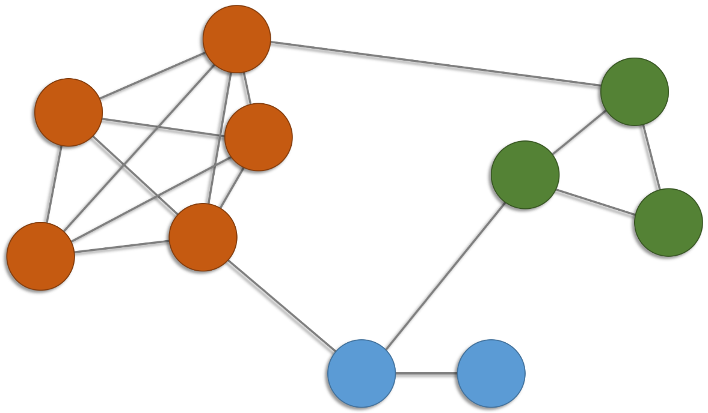
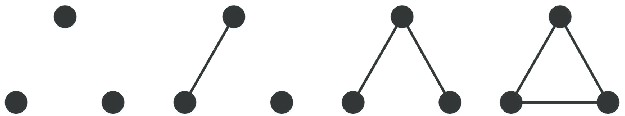
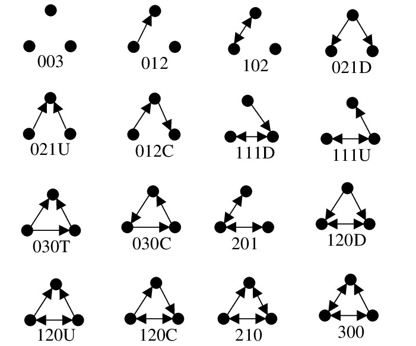

```{r setup, include=FALSE}
knitr::opts_chunk$set(echo = TRUE)
```

# Introducción

La **cohesión** se refiere a la medida en que **subconjuntos de vértices específicos son cohesivos (adherentes)** respecto a la relación que define las aristas.


# *Cliques*

Un enfoque para definir la **cohesión de una red** es mediante la **especificación de subgrafos** de interés.

Un **clan** (*clique*) $C$ de un grafo $G=(V,E)$ es un subconjunto de vértices tal que cada par de vértices distintos son adyacentes, i.e., el subgrafo de $G$ **inducido** por $C$ es un **grafo completo**. 

Clanes de tamaños más grandes incluyen clanes de tamaños más pequeños. 

¿Cuántos clanes?

```{r, eval = TRUE, echo=FALSE, out.width="35%", fig.pos = 'H', fig.align = 'center'}

```


```{r}
# librerias
suppressMessages(suppressWarnings(library(igraph)))
```


```{r, fig.align='center'}
# datos
g <- graph(edges = c(1,2,1,3,1,4,1,5,2,3,2,4,2,5,3,4,3,5,4,5,6,7,6,8,7,8,9,10,1,6,2,9,7,9), directed = F)
Y <- as.matrix(get.adjacency(graph = g, names = F))
```


```{r, fig.align='center'}
# visualización
par(mfrow = c(1,2), mar = c(4, 3, 3, 1))
set.seed(42)
plot(g, vertex.size = 20, vertex.color = 0, vertex.label.color = "black", edge.color = "blue4")
corrplot::corrplot(corr = Y, col.lim = c(0,1), method = "color", tl.col = "black", addgrid.col = "gray", cl.pos = "n")
```


```{r}
# orden
vcount(g)
# tamaño
ecount(g)
# clan?
c1 <- induced_subgraph(graph = g, vids = c(6,7,8))
ecount(c1) == choose(n = vcount(c1), k = 2)
# frecuencias de clanes
table(sapply(X = cliques(graph = g, min = 1, max = 10), FUN = length))
```


Un **clan maximal** (*maximal clique*) es un clan que no se puede extender incluyendo algún otro vértice.

```{r}
# clanes maximales
maximal.cliques(graph = g)
```

Un **clan máximo** (*maximum clique*) es el clan maximal más grande.

El **número clan** (*clique number*) es el tamaño del clan máximo.

```{r}
# clanes máximos
largest.cliques(graph = g)
# número clan
clique.number(graph = g)
```

En la práctica, **clanes "grandes" son escasos**, ya que requieren que el grafo sea denso, pero las **redes reales comúnmente son dispersas** (*sparse*).


## Ejemplo: Interacciones sociales

Red de **interacciones sociales** entre los miembros de un club de karate.

Estos datos fueron recolectados para **estudiar la fragmentación** que sufrió el club en dos clubes diferentes debido a una disputa entre el director y el administrador.

$y_{i,j} = 1$ si los miembros $i$ y $j$ tuvieron una **interacción social** en el club y $y_{i,j} = 0$ en otro caso.

Una descripción completa de los datos se puede encontrar [aquí](https://rdrr.io/cran/igraphdata/man/karate.html).

Disponible en el paquete `igraphdata` de R.

Zachary, W. W. (1977). **An information flow model for conflict and fission in small groups**. Journal of anthropological research, 33(4), 452-473.


```{r}
# librerías
suppressMessages(suppressWarnings(library(igraph)))
suppressMessages(suppressWarnings(library(igraphdata)))
```


```{r}
# datos
data(karate)
karate <- upgrade_graph(karate)
# la representación de datos internos a veces cambia entre versiones
Y <- as.matrix(get.adjacency(graph = karate, names = F))
```


```{r}
# orden
vcount(karate)
# tamaño
ecount(karate)
# dirigida?
is_directed(karate)
# ponderada?
is_weighted(karate)
```


```{r, fig.height = 6, fig.width = 6, fig.align='center'}
# visualización
par(mfrow = c(1,1), mar = c(4, 3, 3, 1))
set.seed(123)
plot(karate, layout = layout_with_dh, vertex.size = 10, vertex.frame.color = "black", vertex.label.color = "black", main = "")
```


```{r}
# clanes máximos
largest.cliques(graph = karate)
# número clan
clique.number(graph = karate)
```


## Ejemplo: Interacciones proteína-proteína

Red de **interacción de proteínas** de levadura. 

Las interacciones proteína-proteína prometen revelar aspectos del sistema regulatorio que subyace a la función celular.

Los nodos corresponden a proteínas y solo se consideran aquellas interacciones que tienen una confianza "moderada" y "alta". 

Una descripción completa de los datos se puede encontrar [aquí](http://www.nature.com/nature/journal/v417/n6887/suppinfo/nature750.html).

Disponible en el paquete `igraphdata` de R.

Von Mering, C., Krause, R., Snel, B., Cornell, M., Oliver, S. G., Fields, S., & Bork, P. (2002). **Comparative assessment of large-scale data sets of protein–protein interactions.** Nature, 417(6887), 399-403.


```{r, eval = TRUE, echo=FALSE, out.width="50%", fig.pos = 'H', fig.align = 'center'}
knitr::include_graphics("04_yeast.png")
```


```{r}
# datos
data(yeast)
yeast <- upgrade_graph(yeast)
# la representación de datos internos a veces cambia entre versiones
```


```{r}
# orden
vcount(yeast)
# tamaño
ecount(yeast)
# dirigida?
is_directed(yeast)
# ponderada?
is_weighted(yeast)
```


```{r}
# número clan
clique.number(graph = yeast)
```


El número clan es relativamente pequeño (incluso para redes "grandes").


# Díadas y tríadas

Otras cantidades de interés son las **díadas** y las **tríadas**.

¿Cuáles son los estados diádicos no dirigidos y dirigidos? 

¿Y los triádicos?

**Estados triádicos no dirigidos** (*undirected triadic motifs*):

```{r, eval = TRUE, echo=FALSE, out.width="43%", fig.pos = 'H', fig.align = 'center'}

```

**Estados triádicos dirigidos** (*directed triadic motifs*):

```{r, eval = TRUE, echo=FALSE, out.width="58%", fig.pos = 'H', fig.align = 'center'}

```

Davis, J.A. and Leinhardt, S. (1972). **The Structure of Positive Interpersonal Relations in Small Groups.** In J. Berger (Ed.), Sociological Theories in Progress, Volume 2, 218-251. Boston: Houghton Mifflin.

Un **censo de los estados diádicos** o **triádicos** proporciona una medida de la conectividad de una red.


## Ejemplo: Blogs de SIDA

Red de **blogs de SIDA, pacientes y sus redes de apoyo**. 

Un enlace dirigido de un blog a otro indica que el primero tiene un enlace al segundo en su página web. 

Una descripción completa de los datos se puede encontrar [aquí](https://rdrr.io/cran/sand/man/aidsblog.html).

Disponible en el paquete `sand` de R.

Miller, H. J. (2007). **Societies and cities in the age of instant access**. In Societies and cities in the age of instant access (pp. 3-28). Springer, Dordrecht.


```{r}
# librerías
suppressMessages(suppressWarnings(library(sand)))
```


```{r}
# data
data(aidsblog)
aidsblog <- upgrade_graph(aidsblog)
# la representación de datos internos a veces cambia entre versiones
```


```{r}
# orden
vcount(aidsblog)
# tamaño
ecount(aidsblog)
# dirigida?
is_directed(aidsblog)
# ponderada?
is_weighted(aidsblog)
```


```{r, fig.height = 6, fig.width = 6, fig.align='center'}
# visualización
set.seed(123)
par(mfrow = c(1,1), mar = c(4, 3, 3, 1))
plot(aidsblog, layout = layout_with_kk, vertex.label = NA, vertex.size = 5, vertex.frame.color = 1, edge.arrow.size = 0.5, main = "")
```


```{r}
# simple?
is_simple(aidsblog)
# simplificación
aidsblog <- simplify(aidsblog)
```


```{r}
# censo de estados diádicos
#   mut   The number of pairs with mutual connections.
#   asym  The number of pairs with non-mutual connections.
#   null  The number of pairs with no connection between them.
dyad_census(aidsblog)
# censo de estados triádicos
#   003   A,B,C, the empty graph.
#   012   A->B, C, the graph with a single directed edge.
#   102   A<->B, C, the graph with a mutual connection between two vertices.
#   021D  A<-B->C, the out-star.
#   021U  A->B<-C, the in-star.
#   021C  A->B->C, directed line.
#   111D  A<->B<-C.
#   111U  A<->B->C.
#   030T  A->B<-C, A->C.
#   030C  A<-B<-C, A->C.
#   201   A<->B<->C.
#   120D  A<-B->C, A<->C.
#   120U  A->B<-C, A<->C.
#   120C  A->B->C, A<->C.
#   210   A->B<->C, A<->C.
#   300   A<->B<->C, A<->C, the complete graph.
triad_census(aidsblog)
```

La gran mayoría de los estados son nulos y de los que no lo son, casi todos son asimétricos, lo que indica una unilateralidad (asimetría) preponderante en la manera en que los blogs se referencian.


# Densidad

La **densidad** (*density*) de un grafo se define como la frecuencia relativa de las aristas observadas respecto al potencial de aristas.

Para un subgrafo $H=(V_H,E_H)$ del grafo $G=(V,E)$, la densidad se calcula como
$$
\textsf{den(H)}=\frac{|E_H|}{|V_H|(|V_H|-1)/2}\,.
$$
En el caso de un **digrafo** el denominador debe ser $|V_H|(|V_H|-1)$.

La densidad asume valores entre 0 y 1 y se puede interpretar como una medida de qué tan cerca se encuentra $H$ de ser un clan.


## Ejemplo: Interacciones sociales


```{r, fig.align='center'}
# densidad
ecount(karate)/(vcount(karate)*(vcount(karate)-1)/2)
edge_density(graph = karate)
mean(Y[lower.tri(Y, diag = F)])
mean(Y[upper.tri(Y, diag = F)])
```


```{r}
# ego networks
g_1  <- induced_subgraph(graph = karate, vids = neighborhood(graph = karate, order = 1, nodes = 1) [[1]])
g_34 <- induced_subgraph(graph = karate, vids = neighborhood(graph = karate, order = 1, nodes = 34)[[1]])
```


```{r}
# densidades
edge_density(graph = g_1)
edge_density(graph = g_34)
```

# Transitividad global

Una **tripla** está constituida por tres nodos que están conectados por dos (tripla abierta) o tres (tripla cerrada) aristas.

La **transitividad** (*transitivity*) de un grafo se cuantifica por medio del **coeficiente de agrupamiento** (*clustering coeffitient*) que se calcula como
$$
\textsf{cl} (G) =\frac{\text{no. triplas cerradas}}{\text{no. triplas}} =\frac{3\times \text{no. triángulos}}{\text{no. triplas}} = \frac{3\tau_\triangle(G)}{\tau_3(G)}\,,
$$
donde $\tau_\triangle(G)$ es el **número de triángulos** de $G$ y $\tau_3(G)$ es el **número de triplas**.

El coeficiente de agrupamiento es una **medida de agrupamiento global** que caracteriza la propensión con la que las triplas forman triángulos.


## Ejemplo

```{r}
# datos
h <- graph(edges = c(1,2,1,3,2,3,1,4), directed = F)
```


```{r, fig.align='center'}
# visualización
set.seed(123)
plot(h, vertex.size = 20, vertex.color = 0, vertex.label.color = "black", edge.color = "blue4")
```


```{r}
# número de triángulos por vértice
count_triangles(graph = h)
# vértices que son parte de un triángulo
triangles(graph = h)
# conteos de estados triádicos
(mot <- motifs(graph = h, size = 3))
# transitividad
3*mot[4]/(mot[3] + 3*mot[4])
transitivity(graph = h, type = "global")
```

## Ejemplo

```{r}
# datos
g <- graph(edges = c(1,2,1,3,1,4,1,5,2,3,2,4,2,5,3,4,3,5,4,5,6,7,6,8,7,8,9,10,1,6,2,9,7,9), directed = F)
```


```{r, fig.align='center'}
# visualización
set.seed(42)
plot(g, vertex.size = 20, vertex.color = 0, vertex.label.color = "black", edge.color = "blue4")
```


```{r}
# número de triángulos por vértice
count_triangles(graph = g)
# vértices que son parte de un triángulo
sort(triangles(graph = g))
# conteos de estados triádicos
(mot <- motifs(graph = g, size = 3))
# transitividad global
3*mot[4]/(mot[3] + 3*mot[4])
transitivity(graph = g, type = "global")
```


# Transitividad local

El **coeficiente de agrupamiento** del vértice $v\in V$ se define teniendo en cuenta la incidencia de $v$ en las aristas que conforman las triplas:
$$
\textsf{cl}(v) = \frac{\text{no. triplas cerradas que incluyen a $v$}}{k_v(k_v-1)/2}\,,
$$
donde $k_v$ es el grado del nodo $v$.

El coeficiente de agrupamiento de un vértice es una **medida de agrupamiento local** que cuantifica qué tan cerca están los vecinos del vértice de ser un clan.

Alternativamente, el  **coeficiente de agrupamiento global** también se puede definir como el promedio de los coeficientes de agrupamiento locales de todos los vértices:
$$
\textsf{cl} (G) = \frac{1}{|V|}\sum_{v\in V} \textsf{cl}(v)\,.
$$

## Ejemplo

```{r}
# datos
g <- graph(edges = c(1,2,1,3,1,4,1,5,2,3,2,4,2,5,3,4,3,5,4,5,6,7,6,8,7,8,9,10,1,6,2,9,7,9), directed = F)
```


```{r, fig.align='center'}
# visualización
set.seed(42)
plot(g, vertex.size = 20, vertex.color = 0, vertex.label.color = "black", edge.color = "blue4")
```


```{r}
# intransitividad local del vértice 1
count_triangles(graph = g)
degree(graph = g)
6/(5*(5-1)/2)
transitivity(graph = g, type = "local")
# transitividad global alternativa
mean(transitivity(graph = g, type = "local", vids = V(g)), na.rm = T)
```

## Ejemplo: Interacciones sociales

```{r}
# transitividad
transitivity(graph = karate, type = "global")
# intransitividad local
transitivity(karate, type = "local", vids = c(1,34))
```


# Reciprocidad

Un concepto exclusivo de los dígrafos es la **reciprocidad**, i.e., la propensión con la que hay reciprocidad de aristas en la red. 

Las frecuencias se pueden calcular respecto al número de díadas o de aristas:
$$
\textsf{rec}(G) = \frac{\text{no. aristas reciprocas}}{\text{no. aristas}}\,,
$$
o alternativamente,
$$
\textsf{rec}(G) = \frac{\text{no. diadas reciprocas}}{\text{no. diadas no reciprocas}}\,.
$$


## Ejemplo: Blogs de SIDA

```{r}
# reciprocidad (aristas)
reciprocity(aidsblog, mode = "default")
# reciprocidad (díadas)
reciprocity(aidsblog, mode = "ratio")
```


# Conectividad

Comúnmente una de las componentes conectadas de un grafo $G=(V,E)$ domina a las demás en magnitud. Tal componente se denomina **componente gigante** (*giant component*).

En la práctica, la atención se restringe a la componente gigante para llevar a cabo tanto el análisis como el modelamiento.

Un grafo $G=(V,E)$ se llama **$k$-conectado** (*$k$-connected*) si $|V|>k$ y la remoción de cualquier subconjunto de vértices $X \subset V$ tal que $|X| < k$ da como resultado un subgrafo que continua estando conectado.

La **conectividad nodal** de un grafo $G=(V,E)$ corresponde al entero más grande $k$ tal que $G$ es $k$-conectado. 

Alternativamente, también se puede definir como el número mínimo de nodos que deben eliminarse para desconectar el grafo.

Un vértice que la ser removido desconecta el grafo se denomina **vértice de corte** (*cut vertex*) o **punto de articulación** (*articulation point*). 

La identificación de tales vértices proporciona una idea de dónde es vulnerable una red.


## Ejemplo

```{r}
# datos
f <- graph(edges = c(1,2,1,3,2,3,1,4,4,5), directed = F)
```


```{r, fig.align='center'}
# visualización
set.seed(123)
plot(f, vertex.size = 20, vertex.color = 0, vertex.label.color = "black", edge.color = "blue4")
```


```{r}
# red conectada?
is_connected(f)
# k-conectividad
vertex_connectivity(f)
edge_connectivity(f)
# puntos de articulación
articulation_points(f)
```


## Ejemplo: Interacciones proteína-proteína

```{r}
# red conectada?
is_connected(yeast)
# componentes
componentes <- decompose(yeast)
length(componentes)
table(sapply(X = componentes, FUN = vcount))
# tamaño de la componte gigante
max(sapply(X = componentes, FUN = vcount))
max(sapply(X = componentes, FUN = vcount))/vcount(yeast)
# componente gigante
yeast_gc <- decompose(yeast)[[1]]
# vértice-conectividad
vertex_connectivity(yeast_gc)
# arista-conectividad
edge_connectivity(yeast_gc)
# puntos de articulación
yeast_cv <- articulation_points(yeast_gc)
length(yeast_cv)
length(yeast_cv)/vcount(yeast_gc)
```

Se requiere la eliminación de un solo vértice o una sola arista para dividir el componente gigante en componentes adicionales.

Aproximadamente el 15\% de los vértices son puntos de articulación.


# Referencias

```{r, eval = TRUE, echo=FALSE, out.width="25%", fig.pos = 'H', fig.align = 'center'}
knitr::include_graphics("01_cover_KC.jpg")
```


```{r, eval = TRUE, echo=FALSE, out.width="25%", fig.pos = 'H', fig.align = 'center'}
knitr::include_graphics("01_cover_Luke.jpg")
```


```{r, eval = TRUE, echo=FALSE, out.width="25%", fig.pos = 'H', fig.align = 'center'}
knitr::include_graphics("01_cover_Menczer.jpg")
```


```{r, eval = TRUE, echo=FALSE, out.width="25%", fig.pos = 'H', fig.align = 'center'}
knitr::include_graphics("01_cover_AK.jpg")
```


```{r, eval = TRUE, echo=FALSE, out.width="25%", fig.pos = 'H', fig.align = 'center'}
knitr::include_graphics("01_cover_Newman.jpg")
```