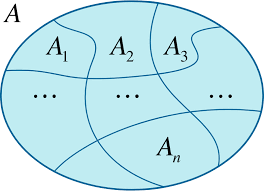
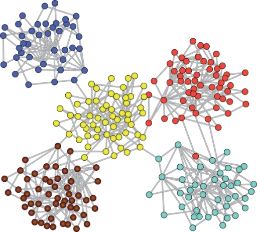
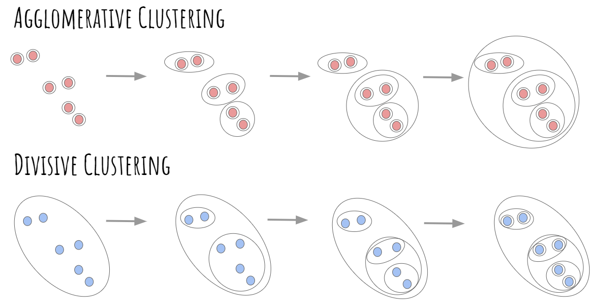
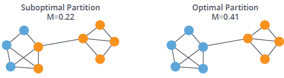
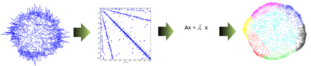

```{r setup, include=FALSE}
knitr::opts_chunk$set(echo = TRUE)
```


# Introducción

El **agrupamiento** (*clustering*/*partitioning*) se refiere a la **segmentación** de un conjunto de elementos en **subconjuntos "naturales"**.

Una **partición** $\mathcal{C}$ de un conjunto finito $S$ se refiere a una **descomposición** de $S$ en $K$ subconjuntos $C_1,\ldots,C_K$ de $S$ tales que:
$$
C_k\neq\Phi\,,\qquad C_k\cap C_\ell = \Phi\,,\qquad \cup_{k=1}^K C_k = S\,,
$$
para $k,\ell\in\{1,\ldots,K\}$ con $k\neq \ell$.

```{r, eval = TRUE, echo=FALSE, out.width="40%", fig.pos = 'H', fig.align = 'center'}

```

La **partición de redes** (*network partitioning*) también conocida como **detección de comunidades** (*commuty detection*), constituye una **metodología no supervisada** para encontrar **subconjuntos de vértices "homogéneos"** respeto a sus patrones relacionales.

Los **algoritmos de agrupamiento** de grafos establecen una **partición** $\mathcal{C}=\{C_1,\ldots,C_K\}$ del **conjunto de vértices** $V$ de un grafo $G=(V,E)$ tal que el conjunto de aristas conectando vértices de $C_k$ con vértices de $C_{\ell}$ sea relativamente "pequeño" comparado con el conjunto de aristas conectando vértices dentro de $C_k$. 

```{r, eval = TRUE, echo=FALSE, out.width="40%", fig.pos = 'H', fig.align = 'center'}

```

Los métodos que se discuten a continuación son **algorítmicos** y  **no constituyen modelos estadísticos**, y por lo tanto, **no permiten cuantificar la incertidumbre** asociada con la detección de las comunidades como la formación de enlaces.


# Agrupación jerárquica

Estos métodos adoptan un **enfoque computacional intensivo** para explorar el espacio de todas las posibles particiones, **modificando iterativamente** las particiones candidatas.

Los métodos difieren principalmente en la **métrica para evaluar la calidad** de las agrupaciones y los **algoritmos para optimizar tal métrica**.

- **Agrupamiento aglomerativo** (*agglomerative clustering*): ampliación de las comunidades a través de **fusión** (*merging*).
- **Agrupamiento divisivo** (*divisive clustering*): refinamiento de las comunidades a través de **división** (*spliting*).

```{r, eval = TRUE, echo=FALSE, out.width="75%", fig.pos = 'H', fig.align = 'center'}

```

En cada etapa del algoritmo, la **partición actual** se modifica de manera que se **minimice/maximice una función de perdida/utilidad específica**  mediante la **acción menos costosa** de fusión/división.

La **modulariad** de una red respecto a una partición mide **qué tan buena es la división** o **qué tan separados están los diferentes tipos de vértices entre sí**:
$$
\textsf{mod}(\mathcal{C}) = \frac{1}{2m} \sum_{i,j:i\neq j} \left(y_{i,j} - \tfrac{1}{2m}d_id_j\right)\delta_{c_i,c_j}\,,
$$
donde:

- $\mathbf{Y}=[y_{i,j}]$ : matriz de adyacencia.
- $m$ : tamaño del grafo (número de aristas).
- $d_i$ : grado del vértice $i$.
- $c_i$ : grupo de la partición al que pertenece el vértice $i$ (*membership* o *cluster assignment*).
- $\delta_{x,y} = 1$ si $x=y$ y $\delta_{x,y} = 0$ en otro caso.

$\textsf{mod}(\mathcal{C}) = 0$ si la formación de aristas ocurre sin tener en cuenta las comunidades de la partición de referencia.

Valores más grandes de $\textsf{mod}(\mathcal{C})$ indican una estructura de comunidades más fuerte.

```{r, eval = TRUE, echo=FALSE, out.width="70%", fig.pos = 'H', fig.align = 'center'}

```
   
`cluster_fast_greedy` en `igraph`.

***Clauset, A., Newman, M. E., & Moore, C. (2004). Finding community structure in very large networks. Physical review E, 70(6), 066111.***


# Particionamiento espectral

El método general de agrupación espectral consiste en utilizar un **método de agrupación estándar** usando los vectores propios más relevantes de la **matriz Laplaciana** de $\mathbf{A}$ dada por $\mathbf{L} = \mathbf{D} - \mathbf{A}$, donde $\mathbf{A} = [a_{i,j}]$ es una **matriz de modularidad** y $\mathbf{D} = \textsf{diag}(d_1,\ldots,d_n)$ es una **matriz diagonal** con entradas
$$
d_i = \sum_{j} a_{i,j}\,.
$$

La **matriz de modularidad** (*modularity matrix*) de un grafo $G=(V,E)$ con matriz de adyacencia $\mathbf{Y}$ corresponde a la matriz $\mathbf{A} = [a_{i,j}]$, donde
$$
a_{i,j} = y_{i,j} - \tfrac{1}{2m}d_id_j\,.
$$

Alternativamente, la **matriz de modularidad** también se puede definir como 
$$
\mathbf{A} = \mathbf{Y} - \mathbf{P}\,,
$$
donde $\mathbf{P}$ contiene las probabilidades de interacción de los vértices bajo el **modelo de configuración** (*configuration model*, modelo que genera redes aleatorias de acuerdo con una secuencia grados específica).

```{r, eval = TRUE, echo=FALSE, out.width="100%", fig.pos = 'H', fig.align = 'center'}

```

`cluster_leading_eigen` en `igraph`.


# Resumen

| Algoritmo | Función en `igraph`  | Idea  |
|:---------:|:--------------------:|:-----:|
| Fast-greedy | `cluster_fast_greedy` | Optimizar una métrica de modularidad |
| Edge-betweenness | `cluster_edge_betweenness` | Optimizar una métrica de aristas basada en caminos más cortos |
| Leading eigenvector | `cluster_leading_eigen` | Calcular el vector propio principal no negativo de la matriz de modularidad |
| Louvain | `cluster_louvain` | Optimizar una métrica de modularidad múltinivel |
| Walktrap | `cluster_walktrap` | Caminatas aleatorias cortas tienden a permanecer en la misma comunidad |
| Label propagation | `cluster_label_prop` | Etiquetar vértices con etiquetas únicas y actualizarlas por votación mayoritaria en la vecindad del vértice |
| InfoMAP | `cluster_infomap` | Optimizar la longitud esperada de una trayectoria de una caminata aleatoria |
| Spinglass | `cluster_spinglass` | Modelo *spin-glass* y *simulated annealing* |
| Optimal | `cluster_optimal` | Optimizar una métrica de modularidad |


# Validación

Cuando se tiene conocimiento de alguna **noción de pertenencia a una clase definida externamente**, resulta interesante interesante **comparar y contrastar las asignaciones resultantes** con las que se derivan de la partición.

`compare` en `igraph`.

Comparación de dos particiones:

- `rand` : *the Rand index* (Rand 1971).
- `adjusted.rand` : *adjusted Rand index* (Hubert and Arabie 1985).
- `vi` : *variation of information (VI) metric* (Meila 2003).
- `nmi` : *normalized mutual information measure* (Danon et al. 2005).
- `split.join` : *split-join distance* (can Dongen 2000).

Por ejemplo, el **índice Rand** tiene un valor entre 0 y 1, donde 0 indica que las dos agrupaciones de datos no coinciden en ningún par de puntos y 1 indica que las agrupaciones de datos son exactamente iguales:
$$
\textsf{RI}(X,Y) = \frac{a+b}{a+b+c+d}
$$
donde:

- $X$ y $Y$: particiones del conjunto de números enteros $S=\{1,\ldots,n\}$.
- $a$: el número de pares de elementos en $S$ que están en el mismo subconjunto en $X$ y en el mismo subconjunto en $Y$.
- $b$: el número de pares de elementos en $S$ que están en diferentes subconjuntos en $X$ y en diferentes subconjuntos en $Y$.
- $c$: el número de pares de elementos en $S$ que están en el mismo subconjunto en $X$ y en diferentes subconjuntos en $Y$.
- $d$: el número de pares de elementos en $S$ que están en diferentes subconjuntos en $X$ y en el mismo subconjunto en $Y$.


# Ejemplo: Interacciones sociales

Red de **interacciones sociales** entre los miembros de un club de karate.

Estos datos fueron recolectados para **estudiar la fragmentación** que sufrió el club en dos clubes diferentes debido a una disputa entre el director y el administrador.

$y_{i,j} = 1$ si los miembros $i$ y $j$ tuvieron una **interacción social** en el club y $y_{i,j} = 0$ en otro caso.

Una descripción completa de los datos se puede encontrar [aquí](https://rdrr.io/cran/igraphdata/man/karate.html).

Disponible en el paquete `igraphdata` de R.

Zachary, W. W. (1977). **An information flow model for conflict and fission in small groups**. Journal of anthropological research, 33(4), 452-473.


```{r}
# librerías
suppressMessages(suppressWarnings(library(igraph)))
suppressMessages(suppressWarnings(library(igraphdata)))
suppressMessages(suppressWarnings(library(sand)))
```


```{r}
# datos
data(karate)
karate <- upgrade_graph(karate)
```


```{r}
# orden
vcount(karate)
# tamaño
ecount(karate)
# dirigida?
is_directed(karate)
# ponderada?
is_weighted(karate)
```


```{r, fig.height = 6, fig.width = 12, fig.align='center'}
# visualización
par(mfrow = c(1,2))
set.seed(123)
l = layout_with_dh(karate)
plot(karate, layout = l, vertex.size = 14, vertex.frame.color = "black", vertex.label.color = "black", main = "")
corrplot::corrplot(corr = as.matrix(get.adjacency(graph = karate, names = F)), col.lim = c(0,1), method = "color", tl.col = "black", addgrid.col = "gray", cl.pos = "n")
```


```{r}
# aplicación del algoritmo
kc <- cluster_fast_greedy(karate)
# estructura
str(kc)
# algoritmo
kc$algorithm
# algoritmo jerárquico?
is_hierarchical(kc)
# asignaciones
kc$membership
# tamaños
sizes(kc)
table(kc$membership)
# tamaño de la partición
length(kc)
length(table(kc$membership))
```


```{r, fig.height = 6, fig.width = 12, fig.align='center'}
# visualización
par(mfrow = c(1,2))
set.seed(1)
plot(x = kc, y = karate, vertex.size = 12)
set.seed(1)
plot(x = kc, y = karate, mark.groups = NULL, edge.color = "darkgray", vertex.size = 12)
```


```{r, fig.height = 6, fig.width = 12, fig.align='center'}
# visualización
par(mfrow = c(1,2))
plot(karate, layout = l, vertex.size = 12, vertex.frame.color = "black", vertex.label.color = "black", main = "Facciones")
plot(karate, layout = l, vertex.size = 12, vertex.frame.color = "black", vertex.label.color = "black", vertex.color = kc$membership, main = "Fast greedy")
```


```{r, fig.height=6, fig.width=12, fig.align='center'}
# funciones
get_adjacency_ordered <- function(xi, A) {
  xi2 <- xi[order(xi)]
  indices <- order(xi)
  d <- NULL
  for (i in 1:(length(xi)-1)) if (xi2[i] != xi2[i+1]) d <- c(d, i)
  list(A = A[indices,indices], d = d)
}
#
heat.plot0 <- function (mat, show.grid = FALSE, cex.axis, tick, labs, col.axis, ...) { 
  JJ <- dim(mat)[1]
  colorscale <- c("white", rev(heat.colors(100)))
  if(missing(labs))     labs <- 1:JJ
  if(missing(col.axis)) col.axis <- rep("black", JJ)
  if(missing(cex.axis)) cex.axis <- 1
  if(missing(tick))     tick <- TRUE
  # adjacency matrix
  image(seq(1, JJ), seq(1, JJ), mat, axes = FALSE, xlab = "", ylab = "", col = colorscale[seq(floor(100*min(mat)), floor(100*max(mat)))], ...)
  for (j in 1:JJ) {
    axis(1, at = j, labels = labs[j], las = 2, cex.axis = cex.axis, tick, col.axis = col.axis[j], col.ticks = col.axis[j])
    axis(2, at = j, labels = labs[j], las = 2, cex.axis = cex.axis, tick, col.axis = col.axis[j], col.ticks = col.axis[j])
  }
  box()
  if (show.grid) grid(nx = JJ, ny = JJ)
}
# asignaciones 
xi <- kc$membership
# asignaciones ordenadas 
xi2 <- xi[order(xi)]
# matriz de adyacencia original
Y <- get.adjacency(graph = karate, sparse = F)
# matriz de adyacencia ordenada y lineas divisorias de acuerdo con las comunidades
tmp <- get_adjacency_ordered(xi = xi, A = Y)
A <- tmp$A
d <- tmp$d
# visualización
par(mfrow = c(1,2))
heat.plot0(mat = Y)
heat.plot0(mat = A, col.axis = c("darkgoldenrod3","deepskyblue3","forestgreen")[xi2], labs = (1:vcount(karate))[order(xi)])
abline(v = d+.5, h = d+.5)
```

```{r, fig.height=6, fig.width=6, fig.align='center'}
# visualización
plot_dendrogram(x = kc, mode = "phylo")
```


# Ejemplo: Interacciones sociales (cont.)


```{r}
# algoritmos
kc_fast_greedy <- cluster_fast_greedy(karate)
kc_leading_eigen <- cluster_leading_eigen(karate)
kc_walktrap <- cluster_walktrap(karate)
kc_louvain <- cluster_louvain(karate)
kc_label_prop <- cluster_label_prop(karate)
kc_spinglass <- cluster_spinglass(karate)
kc_optimal <- cluster_optimal(karate)
kc_infomap <- cluster_infomap(karate)
```


```{r, fig.width=12, fig.height=12, fig.align='center'}
# gráficos
igraph_options(vertex.size = 10, vertex.frame.color = "black")
par(mfrow = c(3,3))
plot(karate, vertex.label = NA, layout = l, vertex.color = kc_fast_greedy$membership, main = paste0("fast greedy: ", "Mod = ", round(modularity(kc_fast_greedy), 4)))
plot(karate, vertex.label = NA, layout = l, vertex.color = kc_leading_eigen$membership, main = paste0("leading eigen: ", "Mod = ", round(modularity(kc_leading_eigen), 4)))
plot(karate, vertex.label = NA, layout = l, vertex.color = kc_walktrap$membership, main = paste0("walktrap: ", "Mod = ", round(modularity(kc_walktrap), 4)))
plot(karate, vertex.label = NA, layout = l, vertex.color = kc_louvain$membership, main = paste0("louvain: ", "Mod = ", round(modularity(kc_louvain), 4)))
plot(karate, vertex.label = NA, layout = l, vertex.color = kc_label_prop$membership, main = paste0("label prop: ", "Mod = ", round(modularity(kc_label_prop), 4)))
plot(karate, vertex.label = NA, layout = l, vertex.color = kc_spinglass$membership, main = paste0("spinglass: ", "Mod = ", round(modularity(kc_spinglass), 4)))
plot(karate, vertex.label = NA, layout = l, vertex.color = kc_optimal$membership, main = paste0("optimal: ", "Mod = ", round(modularity(kc_optimal), 4)))
plot(karate, vertex.label = NA, layout = l, vertex.color = kc_infomap$membership, main = paste0("infomap: ", "Mod = ", round(modularity(kc_infomap), 4)))
```


# Ejemplo: Interacciones sociales (cont.)


```{r, fig.height = 6, fig.width = 12}
fc <- as.numeric(as.factor(vertex_attr(graph = karate, name = "Faction")))
table(fc)
# aplicación de algoritmos
kc_fast_greedy <- cluster_fast_greedy(karate)
kc_leading_eigen <- cluster_leading_eigen(karate)
# comparación
compare(comm1 = fc, comm2 = kc_fast_greedy$membership, method = "rand")
compare(comm1 = fc, comm2 = kc_leading_eigen$membership, method = "rand")
# tablas cruzadas
table(fc, kc_fast_greedy$membership)
table(fc, kc_leading_eigen$membership)
```

# Ejemplo: Simulación

Considere el **modelo de bloques aleatorios** dado por
$$
y_{i,j}\mid\xi_i,\xi_j,\Theta \sim\textsf{Ber}(\theta_{\phi(\xi_i,\xi_j)})\,,\qquad \text{para} 1\leq i<j\leq n\,,
$$
donde:

* $n$ : número de nodos de la red.
* $\xi_i$ : indicadora de cluster del nodo $i$, i.e., $\xi_i=k$ indica que el nodo $i$ hace parte del cluster $k$, para $k=1,\ldots,K$. 
* $\Theta$ : matriz simétrica de $K\times K$ constituida por las probabilidades de interacción intra e inter cluster.
* $\phi(x,y)$ : función de valor vectorial definida por $\phi(x,y)= (\min(x,y),\max(x,y))$.

A continuación se genera una red de acuerdo con este modelo con grupos de aproximadamente el mismo tamaño usando $n = 100$, $K = 4$ y
$$
\Theta = 
\begin{bmatrix}
0.05 & 0.05 & 0.05 & 0.05 \\
0.05 & 0.10 & 0.05 & 0.05 \\
0.05 & 0.05 & 0.20 & 0.05 \\
0.05 & 0.05 & 0.05 & 0.40 \\
\end{bmatrix}\,.
$$

```{r}
# funciones
#
phi <- function(x, y) c(min(x,y), max(x, y))
#
sim_blocks <- function (n, p, Theta) {
     # simulación redes no dirigidas (modelo de bloques estocásticos)
     K  <- length(p) 
     xi <- sample(x = 1:K, size = n, replace = T, prob = p)
     Y  <- matrix(data = 0, nrow = n, ncol = n)
     for (i in 1:(n-1)) {
          for (j in (i+1):n) {
               index <- phi(xi[i], xi[j])
               Y[i,j] <- Y[j,i] <- rbinom(n = 1, size = 1, prob = Theta[index[1], index[2]])
          }
     }
     list(Y = Y, xi = xi)
}
```


```{r}
# argumentos
n <- 100 
p <- rep(0.25, 4)
Theta <- matrix(0.05, 4, 4)
diag(Theta) <- c(0.05, 0.1, 0.2, 0.4)
# simulación
set.seed(1)
tmp <- sim_blocks(n, p, Theta)
Y  <- tmp$Y
xi <- tmp$xi
```


```{r}
# asignaciones ordenadas 
xi2 <- xi[order(xi)]
# matriz de adyacencia ordenada y lineas divisorias de acuerdo con las comunidades
tmp <- get_adjacency_ordered(xi = xi, A = Y)
Y <- tmp$A
d <- tmp$d
g <- graph_from_adjacency_matrix(adjmatrix = Y, mode = "undirected")
```


```{r, fig.height = 6, fig.width = 12, fig.align='center'}
# visualización
par(mfrow = c(1,2))
set.seed(123)
plot(g, layout = layout_with_fr, vertex.label = NA, vertex.size = 6, vertex.frame.color = xi2, vertex.color = xi2, main = "")
heat.plot0(mat = Y, labs = F, tick = F)
abline(v = d+.5, h = d+.5)
```
Ahora, con el fin de establecer la idoneidad de los métodos de agrupamiento, se agrupa la red simulada utilizando algunos métodos de agrupamiento y luego se compara la partición real con la partición recuperado por medio de los métodos:

```{r}
# agrupamiento
c1 <- cluster_fast_greedy  (g)
c2 <- cluster_leading_eigen(g)
c3 <- cluster_walktrap     (g)
c4 <- cluster_louvain      (g)
# comparación usando el índice de rand
out <- c(compare(comm1 = xi, comm2 = c1$membership, method = "rand"),
         compare(comm1 = xi, comm2 = c2$membership, method = "rand"),
         compare(comm1 = xi, comm2 = c3$membership, method = "rand"),
         compare(comm1 = xi, comm2 = c4$membership, method = "rand"))
names(out) <- c("fast_greedy","leading_eigen","walktrap","louvain")
round(out, 3)
```

# Ejemplo: Simulación (cont.)

A continuación se remite el experimento del ejemplo anterior $N = 100$ veces:

```{r}
# experimento
N <- 100
out <- matrix(NA, nrow = N, ncol = 4)
colnames(out) <- c("fast_greedy","leading_eigen","walktrap","louvain")
set.seed(123)
for (i in 1:N) {
     # simular datos
     tmp <- sim_blocks(n, p, Theta)
     g   <- graph_from_adjacency_matrix(adjmatrix = tmp$Y, mode = "undirected")
     xi  <- tmp$xi
     # agrupamiento
     c1 <- cluster_fast_greedy  (g)
     c2 <- cluster_leading_eigen(g)
     c3 <- cluster_walktrap     (g)
     c4 <- cluster_louvain      (g)
     # comparación
     out[i,] <- c(compare(comm1 = xi, comm2 = c1$membership, method = "rand"),
                  compare(comm1 = xi, comm2 = c2$membership, method = "rand"),
                  compare(comm1 = xi, comm2 = c3$membership, method = "rand"),
                  compare(comm1 = xi, comm2 = c4$membership, method = "rand"))
}
```


```{r}
# promedio de índice de rand
round(colMeans(out), 3)
# coeficiente de variación
round(apply(X = out, MARGIN = 2, FUN = sd)/colMeans(out), 3)
```


# Referencias

```{r, eval = TRUE, echo=FALSE, out.width="25%", fig.pos = 'H', fig.align = 'center'}
knitr::include_graphics("01_cover_KC.jpg")
```


```{r, eval = TRUE, echo=FALSE, out.width="25%", fig.pos = 'H', fig.align = 'center'}
knitr::include_graphics("01_cover_Luke.jpg")
```


```{r, eval = TRUE, echo=FALSE, out.width="25%", fig.pos = 'H', fig.align = 'center'}
knitr::include_graphics("01_cover_Menczer.jpg")
```


```{r, eval = TRUE, echo=FALSE, out.width="25%", fig.pos = 'H', fig.align = 'center'}
knitr::include_graphics("01_cover_AK.jpg")
```


```{r, eval = TRUE, echo=FALSE, out.width="25%", fig.pos = 'H', fig.align = 'center'}
knitr::include_graphics("01_cover_Newman.jpg")
```