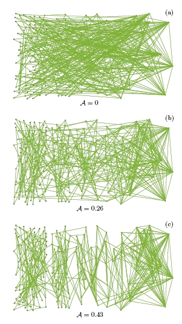
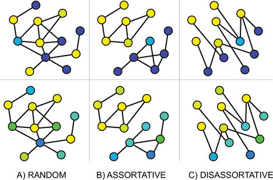
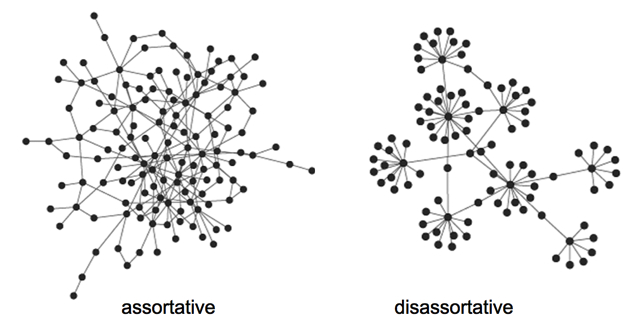
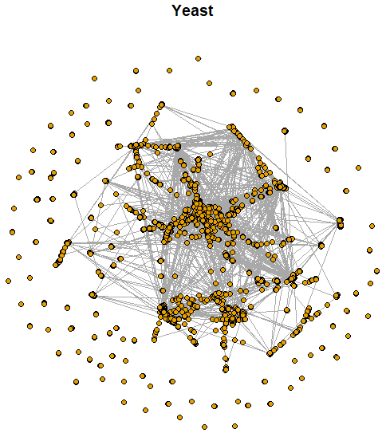

```{r setup, include=FALSE}
knitr::opts_chunk$set(echo = TRUE)
```


# Introducción

La **conexión selectiva** entre vértices de acuerdo con sus características se denomina **mezcla asortativa** (*assortative mixing*).

La **homofilia** se refiere a que nodos similares tienen a relacionarse entre sí.

Los coeficientes de asortatividad miden el nivel de **homofilia** (*homophily*) del grafo, basándose en las etiquetas o valores asignados a los vértices. 

Los coeficientes de asortatividad son positivos si **vértices similares** tienden a conectarse entre ellos, y negativo en caso contrario.

Si el coeficiente es alto, significa que los vértices conectados tienden a tener las mismas etiquetas o valores asignados similares.


```{r, eval = TRUE, echo=FALSE, out.width="40%", fig.pos = 'H', fig.align = 'center'}

```

# Características categóricas

Cada vértice de un grafo $G=(V,E)$ se puede etiquetar de acuerdo con una de $M$ categorías. En este caso, el **coeficiente de asortividad** (*assortativity coefficient*) se define como
$$
r_a = \frac{\sum_{i=1}^n f_{i,i} - \sum_{i=1}^n f_{i\bullet}f_{\bullet i}}{1 - \sum_{i=1}^n f_{i\bullet}f_{\bullet i}}
$$
donde:

- $f_{i,j}$: fracción de aristas que unen un vértice de la $i$-ésima categoría con un vértice de la $j$-ésima categoría.
- $f_{i\bullet} = \sum_{j=1}^n f_{i,j}$.
- $f_{\bullet j} = \sum_{i=1}^n f_{i,j}$.

Propiedades:

- Se tiene que $-1\leq r_a \leq 1$. 
- $r_a=0$ cuando la conexión selectiva no es diferente de la obtenida mediante una asignación aleatoria de aristas que conserva la distribución de los grados (modelo de configuración).
- $r_a=1$ cuando hay una conexión selectiva **asortativa perfecta** (i.e., las aristas solo conectan vértices de la misma categoría). 
- $r_a$ no es necesariamente igual a $-1$ cuando hay una conexión selectiva **desasortativa perfecta** (i.e., las aristas solo conectan vértices de categorías diferentes).

Ver `assortativity_nominal` en `igraph`.


```{r, eval = TRUE, echo=FALSE, out.width="75%", fig.pos = 'H', fig.align = 'center'}

```


# Características numéricas

Cuando la característica de interés es continua, se denota con $(x_e, y_e)$ los valores de esa característica para los vértices unidos por la arista $e \in E$. En este caso, el **coeficiente de assortividad** se define como
$$
r_a = \frac{\sum_{e\in E} xy(f_{x,y} - f_{x\bullet}f_{\bullet y})}{\sigma_x \sigma_y}
$$
donde:

- La suma se hace únicamente sobre las aristas observadas $e\in E$.
- Tanto $f_{x,y}$ como $f_{x\bullet}$ y $f_{\bullet y}$ se definen de manera análoga.
- $\sigma_x$ y $\sigma_y$ son las desviaciones estándar asociadas con las distribuciones de frecuencias de $f_{x\bullet}$ y $f_{\bullet y}$, respectivamente.

Comúnmente la característica continua se toma como el **grado**.

Ver `assortativity` y `assortativity_degree` en `igraph`.


```{r, eval = TRUE, echo=FALSE, out.width="80%", fig.pos = 'H', fig.align = 'center'}

```

# Ejemplo: Interacciones proteína-proteína

Red de **interacción de proteínas** de levadura. 

Las interacciones proteína-proteína prometen revelar aspectos del sistema regulatorio que subyace a la función celular.

Los nodos corresponden a proteínas y solo se consideran aquellas interacciones que tienen una confianza "moderada" y "alta". 

Una descripción completa de los datos se puede encontrar [aquí](http://www.nature.com/nature/journal/v417/n6887/suppinfo/nature750.html).

Disponible en el paquete `igraphdata` de R.

Von Mering, C., Krause, R., Snel, B., Cornell, M., Oliver, S. G., Fields, S., & Bork, P. (2002). **Comparative assessment of large-scale data sets of protein–protein interactions.** Nature, 417(6887), 399-403.


```{r, eval = TRUE, echo=FALSE, out.width="50%", fig.pos = 'H', fig.align = 'center'}

```


```{r}
# librerías
suppressMessages(suppressWarnings(library(igraph)))
suppressMessages(suppressWarnings(library(igraphdata)))
```


```{r}
# datos
data(yeast)
yeast <- upgrade_graph(yeast)
# la representación de datos internos a veces cambia entre versiones
```


```{r}
# orden
vcount(yeast)
# tamaño
ecount(yeast)
# dirigida?
is_directed(yeast)
# ponderada?
is_weighted(yeast)
```


```{r}
# clases
table(V(yeast)$Class)
sum(table(V(yeast)$Class))
# hay NAs?
table(is.na(V(yeast)$Class))
```


```{r}
# clase P: desempeñan un papel en la síntesis de proteínas
v.types <- (V(yeast)$Class == "P") + 1
v.types[is.na(v.types)] <- 1
table(v.types)
```


```{r}
# asortatividad nominal
assortativity_nominal(graph = yeast, types = v.types, directed = F)
# asortatividad grado
assortativity_degree(yeast)
```


## Ejemplo: Interacciones sociales

Red de **interacciones sociales** entre los miembros de un club de karate.

Estos datos fueron recolectados para **estudiar la fragmentación** que sufrió el club en dos clubes diferentes debido a una disputa entre el director y el administrador.

$y_{i,j} = 1$ si los miembros $i$ y $j$ tuvieron una **interacción social** en el club y $y_{i,j} = 0$ en otro caso.

Una descripción completa de los datos se puede encontrar [aquí](https://rdrr.io/cran/igraphdata/man/karate.html).

Disponible en el paquete `igraphdata` de R.

Zachary, W. W. (1977). **An information flow model for conflict and fission in small groups**. Journal of anthropological research, 33(4), 452-473.

```{r}
# datos
data(karate)
karate <- upgrade_graph(karate)
# la representación de datos internos a veces cambia entre versiones
Y <- as.matrix(get.adjacency(graph = karate, names = F))
```


```{r}
# orden
vcount(karate)
# tamaño
ecount(karate)
# dirigida?
is_directed(karate)
# ponderada?
is_weighted(karate)
```

```{r, fig.height = 6, fig.width = 6, fig.align='center'}
# visualización
par(mfrow = c(1,1), mar = c(4, 3, 3, 1))
set.seed(123)
plot(karate, layout = layout_with_dh, vertex.size = 10, vertex.frame.color = "black", vertex.label.color = "black", main = "")
```


```{r}
# clase
v.types <- V(karate)$Faction
# asortatividad nominal
assortativity_nominal(graph = karate, types = v.types, directed = F)
# asortatividad grado
assortativity_degree(karate)
```


# Ejemplo: Trabajo colaborativo

Red de **relaciones de trabajo colaborativo** entre los miembros de una firma de abogados (SG&R). 

Estos datos fueron recolectados para **estudiar la cooperación** entre los actores de una organización.

$y_{i,j} = 1$ si los miembros $i$ y $j$ **trabajaron juntos** en al menos un caso y $y_{i,j} = 0$ en otro caso.

Una descripción completa de los datos se puede encontrar [aquí](https://www.stats.ox.ac.uk/~snijders/siena/Lazega_lawyers_data.htm).

Disponible en el paquete `sand` de R.

Lazega, E. (2001). **The collegial phenomenon: The social mechanisms of cooperation among peers in a corporate law partnership**. Oxford University Press on Demand.


```{r}
# install.packages("sand")
suppressMessages(suppressWarnings(library(sand)))
```


```{r}
# datos
lazega <- graph_from_data_frame(d = elist.lazega, directed = "F", vertices = v.attr.lazega)
V(lazega)$label <- sub("V", "", V(lazega)$name)
```


```{r}
# simple?
is_simple(lazega)
# ponderado?
is_weighted(lazega)
# orden
vcount(lazega)
# tamaño
ecount(lazega)
```


```{r, fig.height = 6, fig.width = 6, echo = F, fig.align='center'}
# visualización
set.seed(123)
plot(lazega, layout = layout_with_fr, vertex.size = 12, vertex.frame.color = "black", vertex.label.color = "black")
title(main = "Lazega")
```


```{r}
# asortatividad nominal
assortativity(graph = lazega, types1 = V(lazega)$Office)
assortativity(graph = lazega, types1 = V(lazega)$Practice)
assortativity(graph = lazega, types1 = V(lazega)$School)
# asortatividad continua
assortativity(graph = lazega, types1 = V(lazega)$Years)
# asortatividad grado
assortativity(graph = lazega, types1 = degree(lazega))
assortativity_degree(graph = lazega, directed = F)
```


# Referencias

```{r, eval = TRUE, echo=FALSE, out.width="25%", fig.pos = 'H', fig.align = 'center'}
knitr::include_graphics("01_cover_KC.jpg")
```


```{r, eval = TRUE, echo=FALSE, out.width="25%", fig.pos = 'H', fig.align = 'center'}
knitr::include_graphics("01_cover_Luke.jpg")
```


```{r, eval = TRUE, echo=FALSE, out.width="25%", fig.pos = 'H', fig.align = 'center'}
knitr::include_graphics("01_cover_Menczer.jpg")
```


```{r, eval = TRUE, echo=FALSE, out.width="25%", fig.pos = 'H', fig.align = 'center'}
knitr::include_graphics("01_cover_AK.jpg")
```


```{r, eval = TRUE, echo=FALSE, out.width="25%", fig.pos = 'H', fig.align = 'center'}
knitr::include_graphics("01_cover_Newman.jpg")
```