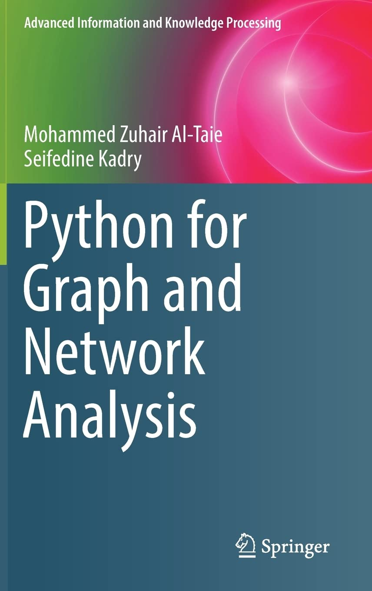

```{r setup, include=FALSE}
knitr::opts_chunk$set(echo = TRUE)
```


# Introducción

Los **modelos de grafos aleatorios exponenciales** (*exponential random graph models*, ERGMs) o **modelos $p^*$** se especifican de manera análoga a los **modelos lineales generalizados** (*generalized linear models*, GLMs).

Wasserman, S., & Pattison, P. (1996). **Logit models and logistic regressions for social networks: I. An introduction to Markov graphs and \(p^*\).** *Psychometrika, 61*(3), 401–425. https://doi.org/10.1007/BF02294547

Frank, O., & Strauss, D. (1986). **Markov graphs.** *Journal of the American Statistical Association, 81*(395), 832–842. https://doi.org/10.2307/2289017

https://cran.r-project.org/web/packages/ergm/vignettes/ergm.pdf

Un **Modelo de Grafos Aleatorios Exponenciales** (ERGM, por sus siglas en inglés) se define como:  
\[
p(\mathbf{y} \mid \boldsymbol{\theta}) = \frac{1}{\kappa} \, \exp{\left\{ \boldsymbol{\theta}^{\textsf{T}} \, \boldsymbol{\mathsf{g}}(\mathbf{y}) \right\}},
\]  
donde:

- **\(\mathbf{y} = [y_{i,j}]\)**: Es la realización de una **matriz de adyacencia aleatoria** \(\mathbf{Y} = [Y_{i,j}]\) asociada con una **red binaria simple no dirigida**.
- **\(\boldsymbol{\mathsf{g}}(\mathbf{y}) = [\mathsf{g}_1(\mathbf{y}), \ldots, \mathsf{g}_K(\mathbf{y})]^{\textsf{T}}\)**: Es un **vector de \(K\) dimensiones** que contiene:
  - **Estadísticos endógenos**: Funciones definidas únicamente en términos de \(\mathbf{y}\) (e.g., número de aristas, triángulos, etc.).
  - **Estadísticos exógenos**: Funciones que dependen de \(\mathbf{y}\) y de atributos nodales \(\mathbf{x}\) (e.g., homofilia basada en características de los nodos).
- **\(\boldsymbol{\theta} = [\theta_1, \ldots, \theta_K]^{\textsf{T}}\)**: Es un **vector de parámetros desconocidos** que cuantifican la influencia de los estadísticos \(\mathsf{g}_k(\mathbf{y})\) sobre la estructura de la red.
- **\(\kappa \equiv \kappa(\boldsymbol{\theta})\)**: Es la **constante de normalización**, definida como:
  \[
  \kappa = \sum_{\mathbf{y}} \exp{\left\{ \boldsymbol{\theta}^{\textsf{T}} \, \boldsymbol{\mathsf{g}}(\mathbf{y}) \right\}},
  \]
  que asegura que \(p(\mathbf{y} \mid \boldsymbol{\theta})\) sea una distribución de probabilidad válida.

Este modelo permite capturar dependencias complejas en la estructura de la red, incorporando tanto **patrones locales** como **atributos externos de los nodos**.

Los coeficientes \(\boldsymbol{\theta}\) indican el **magnitud** y la **dirección del efecto** de los estadísticos \(\boldsymbol{\mathsf{g}}(\mathbf{y})\) sobre la **probabilidad de que la red observada adopte una estructura específica**.

La probabilidad del grafo completo puede reescribirse en **escala logit**, utilizando las **probabilidades condicionales de observar una arista entre dos nodos mientras se mantiene fija el resto de la red**:

\[
\text{logit}\,\textsf{Pr}(y_{i,j}=1 \mid \mathbf{y}_{-(i,j)}) = \boldsymbol{\theta}^{\textsf{T}} \, \boldsymbol{\delta}_{i,j}(\mathbf{y}),
\]

donde:

- \(\mathbf{y}_{-(i,j)}\): Representa la red \(\mathbf{y}\), **excluyendo la observación** \(y_{i,j}\).  
- \(\boldsymbol{\delta}_{i,j}(\mathbf{y})\): Es la **estadística de cambio**, definida como la diferencia entre los valores de \(\boldsymbol{\mathsf{g}}(\mathbf{y})\) cuando \(y_{i,j} = 1\) y cuando \(y_{i,j} = 0\), manteniendo **constantes** todas las demás aristas de la red.  
- Los **coeficientes \(\boldsymbol{\theta}\)** se interpretan como la **contribución marginal de los términos** a la probabilidad condicional (en escala logit) de observar una arista particular \(y_{i,j}\), dado que las conexiones de las demás díadas permanecen sin cambios.

Este enfoque permite descomponer la probabilidad global de la red en términos de las **dependencias locales** capturadas por las estadísticas de cambio.


# Ajuste del modelo

Aquí está el texto mejorado con la notación de \(\boldsymbol{\theta}\) colocada debajo del \(\text{arg max}\):

El **estimador de máxima verosimilitud** (*Maximum Likelihood Estimator*, MLE) de \(\boldsymbol{\theta}\) se define como:  

\[
\hat{\boldsymbol{\theta}}_{\text{MLE}} = \underset{\boldsymbol{\theta}}{\text{arg max}} \, \ell(\boldsymbol{\theta}) = \underset{\boldsymbol{\theta}}{\text{arg max}} \, \left( \boldsymbol{\theta}^{\textsf{T}} \, \boldsymbol{\mathsf{g}}(\mathbf{y}) - \psi(\boldsymbol{\theta}) \right),
\]  

donde \(\psi(\boldsymbol{\theta}) = \log \kappa(\boldsymbol{\theta})\) es el término de **normalización logarítmica**, que depende de todos los posibles valores de la red \(\mathbf{y}\).  

Sin embargo, **\(\psi(\boldsymbol{\theta})\) no puede calcularse explícitamente**, ya que requiere una suma sobre \(2^{\binom{n}{2}}\) términos (uno por cada configuración posible de la red), lo cual es computacionalmente impracticable para redes de tamaño moderado o grande.  

El paquete `ergm` implementa una aproximación al **estimador de máxima verosimilitud** utilizando **Métodos de Monte Carlo basados en cadenas de Markov** (*Markov Chain Monte Carlo*, MCMC), que permiten estimar \(\psi(\boldsymbol{\theta})\) de manera eficiente simulando una muestra representativa de redes en lugar de evaluar todas las configuraciones posibles.

Geyer, C. J., & Thompson, E. A. (1992). **Constrained Monte Carlo maximum likelihood for dependent data.** Journal of the Royal Statistical Society: Series B (Methodological), 54(3), 657–683. https://doi.org/10.1111/j.2517-6161.1992.tb01443.x  

Hunter, D. R., & Handcock, M. S. (2006). **Inference in curved exponential family models for networks.** Journal of Computational and Graphical Statistics, 15(3), 565–583. https://doi.org/10.1198/106186006X133069


# Modelo Bernoulli

Para cada par de vértices, la presencia o ausencia de una arista es **independiente del estado de las demás aristas**. Esto se expresa como:  

\[
p(\mathbf{y} \mid \boldsymbol{\theta}) = \frac{1}{\kappa} \, \exp{\left\{ \sum_{i<j} \theta_{i,j} \, y_{i,j} \right\}},
\]  

donde \(\theta_{i,j}\) representa el efecto específico para cada par de nodos \(i\) y \(j\).  

Si asumimos \(\theta_{i,j} \equiv \theta\), es decir, **homogeneidad relacional** a través de toda la red, el modelo se simplifica a:  

\[
p(\mathbf{y} \mid \boldsymbol{\theta}) = \frac{1}{\kappa} \, \exp{\left\{ \theta \, S(\mathbf{y}) \right\}},
\]  

donde \(S(\mathbf{y}) = \sum_{i<j} y_{i,j}\) es el **número total de aristas** en el grafo. Esto implica que los **log-odds** de observar \(\mathbf{y}\) son **proporcionales al número de aristas en la red**.  

Bajo estas suposiciones, el modelo es equivalente a:  

\[
y_{i,j} \mid \theta \stackrel{\text{iid}}{\sim} \textsf{Bernoulli}(\textsf{expit}(\theta)), \quad i < j,
\]  

donde \(\textsf{expit}(x) = 1 / (1 + \exp(-x))\) es la **función logística inversa**, que invierte la relación de \(\textsf{logit}(x) = \log(x / (1-x))\).  

En este contexto, el estadístico \(S(\mathbf{y})\) corresponde al término `edges` en el paquete `ergm`, lo que modela la **densidad general de conexiones en la red**.


## Ejemplo: Familias Florentinas

Se examinan las **relaciones matrimoniales y comerciales** como mecanismos fundamentales para la **estructuración y consolidación del poder** entre las familias élite de Florencia durante el Renacimiento. 

Mediante un enfoque histórico-social, Padgett explora cómo estas conexiones moldearon la **formación de alianzas estratégicas**, fortalecieron la **perpetuación de jerarquías sociales** y dinamizaron las **relaciones políticas** en un periodo crucial de transformación social y económica.

Padgett, J. F. (1994). **Marriage and Elite Structure in Renaissance Florence, 1282-1500**. Ponencia presentada en la reunión de la Social Science History Association, Atlanta, Georgia.


```{r}
# paquetes
suppressMessages(suppressWarnings(library(ergm)))
# datos
data(florentine)
flomarriage
# clase
class(flomarriage)
```


```{r, fig.width=7, fig.height=6, fig.align='center'}
# gráfico
par(mfrow = c(1,1), mar = 0.2*c(1,1,1,1))
set.seed(42)
plot(flomarriage, label = network.vertex.names(flomarriage))
```


Al representar los tamaños de los vértices en proporción a la riqueza, se evidencia una posible relación entre la **riqueza** y la **sociabilidad**, sugiriendo que los nodos más ricos tienden a ser más sociables o estar mejor conectados en la red.


```{r}
# formulación del modelo
ergm_model<- formula(flomarriage ~ edges)
summary(ergm_model)
```


```{r}
# ajuste del modelo
set.seed(42)
ergm_fit <- ergm(formula = ergm_model)
summary(ergm_fit)
```

Al ajustar un modelo **ERGM**, el resumen incluye una tabla con las siguientes columnas:

1. **Estimate**: Coeficiente estimado para cada término. Indica la **dirección** (positivo o negativo) y la **magnitud** del efecto sobre la probabilidad de la red observada.
2. **Std. Error**: Error estándar del coeficiente. Mide la **incertidumbre** asociada a la estimación.
3. **MCMC %**: Porcentaje de error atribuido al uso de **MCMC**. Valores bajos indican estimaciones estables; valores altos sugieren posibles problemas de convergencia.
4. **z value**: Estadístico \(z\), que evalúa la relación entre el coeficiente y su error estándar (\(z = \text{Estimate} / \text{Std. Error}\)).
5. **Pr(>|z|)**: Valor p asociado al estadístico \(z\). Evalúa la significancia del coeficiente:
   - \(p < 0.05\): Efecto significativo.
   - \(p \geq 0.05\): Efecto no significativo.

Interpretación general:

- **Estimate positivo**: Incrementa la probabilidad de observar el patrón modelado.
- **Estimate negativo**: Reduce la probabilidad del patrón.
- Los valores **Std. Error**, **MCMC %**, y **Pr(>|z|)** ayudan a evaluar la precisión y significancia de cada término.


```{r}
# estadístico
ergm_fit$nw.stats
# coeficiente
coefficients(ergm_fit)
# error estándar
sqrt(vcov(ergm_fit))
# z value
-1.6094/0.2449
# H0: par = 0
2*pnorm(q = -6.571662)
# Null model loglik
ergm_fit$null.lik
# Null Deviance
-2*as.numeric(ergm_fit$null.lik)
# Model 1 loglik
ergm_fit$mle.lik
# Residual Deviance
-2*as.numeric(ergm_fit$mle.lik)
# AIC = -2*loglik + 2*k
-2*as.numeric(ergm_fit$mple.lik) + 2*1 
 # BIC = -2loglik + log(n*(n-1)/2)*k
-2*as.numeric(ergm_fit$mple.lik) + log(16*15/2)*1
```


```{r}
# más componentes 
names(ergm_fit)
``` 


```{r}
# probabilidad
expit <- function(x) 1/(1+exp(-x))
expit(-1.609438)
# densidad de la red
A <- as.matrix.network.adjacency(x = flomarriage)
g <- igraph::graph_from_adjacency_matrix(adjmatrix = A, mode = "undirected")
igraph::edge_density(graph = g)
```


El modelo `NULL` corresponde al modelo de Erdős-Rényi con \(\theta = 0.5\).  

La **probabilidad condicional en escala logit (log-odds)** de que una arista esté presente entre dos actores, manteniendo fija el resto de la red, se calcula como: \[
\text{logit}\,\textsf{Pr}(y_{i,j}=1 \mid \mathbf{y}_{-(i,j)}) = -1.609438 \cdot (\text{cambio en el número de aristas}) = -1.609438 \cdot 1 = -1.609438.
\]

En **escala natural**, la probabilidad correspondiente se obtiene aplicando la función logística inversa (\(\text{expit}\)):  
\[
\textsf{Pr}(y_{i,j}=1 \mid \mathbf{y}_{-(i,j)}) = \text{expit}(-1.609438) = \frac{1}{1 + \exp(1.609438)} = 0.1666667.
\]

Esto indica que la probabilidad de que exista una arista entre dos nodos en este modelo es aproximadamente **16.67%**.


```{r}
# anova
anova(ergm_fit)
```


```{r}
# Model 1 Deviance
166.3553 - 108.1347
# H0: Null model
pchisq(q = 58.221, df = 1, lower.tail = F) 
```

El modelo Bernoulli resulta ser significativo. 


# Modelo de estrellas y triángulos

Se busca incorporar **estadísticos de orden superior** que capturen aspectos de la **estructura global** del grafo. Estos incluyen el **número de \(k\)-estrellas**, denotado como \(S_k(\mathbf{y})\), que representa un subgrafo compuesto por \(k+1\) vértices y \(k\) aristas, y el **número de triángulos**, \(T(\mathbf{y})\). Específicamente:  

- \(S_1(\mathbf{y})\) corresponde al **número de aristas** del grafo.  
- \(T(\mathbf{y})\) mide la cantidad de **triángulos**, capturando cliques locales de tres nodos conectados mutuamente.  

El modelo propuesto tiene la siguiente forma:  
\[
p(\mathbf{y} \mid \boldsymbol{\theta}) = \frac{1}{\kappa} \, \exp{\left\{ \sum_{k=1}^{n-1} \theta_k \, S_k(\mathbf{y}) + \theta_T \, T(\mathbf{y}) \right\}},
\]

donde \(n\) es el **orden del grafo** (número de nodos). Este enfoque permite modelar dependencias complejas en la red mediante la inclusión de términos que reflejan tanto la **densidad** (\(S_1(\mathbf{y})\)) como la **tendencia a formar estructuras locales más cohesionadas** (\(T(\mathbf{y})\) y \(S_k(\mathbf{y})\) para \(k \geq 2\)).


```{r, eval = TRUE, echo=FALSE, out.width="50%", fig.pos = 'H', fig.align = 'center'}
knitr::include_graphics("stars.png")
```


```{r, eval = TRUE, echo=FALSE, out.width="10%", fig.pos = 'H', fig.align = 'center'}
knitr::include_graphics("triangle.png")
```


Comúnmente, se ajustan modelos que incluyen los estadísticos \(S_1(\mathbf{y})\), \(S_2(\mathbf{y})\), \(S_3(\mathbf{y})\) y \(T(\mathbf{y})\).  

En este caso, el estado de cualquier triángulo que contenga la díada \(y_{i,j}\) depende del estado de las díadas \(y_{i,k}\) y \(y_{j,k}\). Por lo tanto, las **díadas no son probabilísticamente independientes** entre sí.  

A diferencia del modelo de Bernoulli, este enfoque genera grafos con **dependencias estructurales entre las aristas**. Específicamente, introduce una **dependencia Markoviana**, donde dos aristas son dependientes siempre que compartan un vértice, dadas todas las demás aristas posibles.  

Sin embargo, este modelo puede enfrentar **problemas de degeneración**, lo que significa que la distribución de probabilidad asigna una cantidad excesivamente grande de su masa a un pequeño conjunto de configuraciones posibles, lo que limita su capacidad para representar estructuras de red diversas.  

En el paquete `ergm`, los términos `kstar` y `triangle` se utilizan para modelar, respectivamente, las \(k\)-estrellas y los triángulos, capturando estas dependencias locales de forma explícita.


## Ejemplo: Familias Florentinas (cont.)


```{r}
# formulación del modelo
ergm_model <- formula(flomarriage ~ edges + triangles)
summary(ergm_model)
```


```{r}
# ajuste del modelo
set.seed(42)
ergm_fit <- ergm(formula = ergm_model)
summary(ergm_fit)
```


```{r}
# probabilidades
expit(-1.6862)
expit(-1.5296)
```


La **probabilidad condicional en escala logit (log-odds)** de que una arista \(y_{i,j}\) esté presente entre dos actores, manteniendo fija el resto de la red, se define como:  

\[
\text{logit}\,\textsf{Pr}(y_{i,j}=1 \mid \mathbf{y}_{-(i,j)}) = -1.6862 \cdot (\text{cambio en el número de aristas}) + 0.1566 \cdot (\text{cambio en el número de triángulos}).
\]

- Si la arista **no forma ningún triángulo**, el log-odds es:  
  \[
  -1.6862.
  \]  
- Si la arista **forma un triángulo**, el log-odds es:  
  \[
  -1.6862 + 0.1566 = -1.5296.
  \]  

En **escala de probabilidad natural**, estas log-odds se transforman mediante la función logística inversa (\(\text{expit}\)):  

- Para una arista que **no forma triángulos**, la probabilidad es:  
  \[
  \text{expit}(-1.6862) = \frac{1}{1 + \exp(1.6862)} \approx 0.1563.
  \]  
- Para una arista que **forma un triángulo**, la probabilidad es:  
  \[
  \text{expit}(-1.5296) = \frac{1}{1 + \exp(1.5296)} \approx 0.1781.
  \]  

Esto muestra que la probabilidad de que exista una arista aumenta ligeramente cuando contribuye a la formación de un triángulo, reflejando la influencia positiva de la estadística de triángulos sobre la estructura de la red.


```{r}
# anova
anova(ergm_fit)
```

El modelo resulta ser significativo. 


## Ejemplo: Sampson

Sampson (1969) documentó las **interacciones sociales** entre un grupo de monjes durante su residencia en un claustro, con un interés particular en las **relaciones de afecto positivo**.  

En el estudio, cada monje seleccionó sus tres principales opciones (o cuatro, en caso de empate) de relaciones de "agrado". Se considera que existe una **arista dirigida** del monje A al monje B si A incluyó a B entre sus principales elecciones. Este enfoque permite capturar la **estructura de las preferencias sociales** dentro del grupo.  

Sampson, S. F. (1968). **A novitiate in a period of change: An experimental and case study of relationships**. Tesis doctoral no publicada, Departamento de Sociología, Cornell University.


```{r}
# datos
data(samplk)
samplk3
```


```{r, fig.width=6, fig.height=6, fig.align='center'}
# gráfico
par(mfrow = c(1,1), mar = 0.2*c(1,1,1,1))
set.seed(42)
plot(samplk3, vertex.cex = 2)
```


```{r}
# formulación del modelo
ergm_model <- formula(samplk3 ~ edges + mutual)
summary(ergm_model)
```


```{r}
# ajuste del modelo
set.seed(42)
ergm_fit <- ergm(formula = ergm_model)
summary(ergm_fit)
```


```{r}
# probabilidades
expit(0.1449)
expit(-2.1707)
```


- Existe un **efecto de reciprocidad significativo** en la red.  
- Los **coeficientes asociados con la densidad y la reciprocidad** se cancelan aproximadamente en el caso de una arista mutua, lo que da lugar a una **probabilidad condicional** de \(0.5362\).  
- Para una **arista no mutua**, el **log-odds condicional** es \(-2.1707\), lo que corresponde a una **probabilidad condicional** de \(0.1024\).  


```{r}
# anova
anova(ergm_fit)
```

El modelo resulta ser significativo.


# Modelo con atributos de los vértices

La **plausibilidad** de que una arista conecte dos vértices no solo depende del **estado de las aristas** (\(0\) o \(1\)), sino también de los **atributos de los vértices** (variables exógenas).  

En un **ERGM**, los atributos de los vértices pueden integrarse mediante la siguiente formulación:  
\[
\boldsymbol{\mathsf{g}}(\mathbf{y}, \mathbf{x}) = \sum_{i<j} y_{i,j} \, h(\mathbf{x}_i, \mathbf{x}_j),
\]  
donde:
- \(h(\mathbf{x}_i, \mathbf{x}_j)\): Es una **función simétrica** que evalúa cómo interactúan los atributos \(\mathbf{x}_i\) y \(\mathbf{x}_j\).  
- \(\mathbf{x}_i\): Es el vector de atributos observados del vértice \(i\).  

### Ejemplos de funciones \(h(\mathbf{x}_i, \mathbf{x}_j)\):

1. **Efectos principales**:

   - \(h(x_i, x_j) = x_i + x_j\): Evalúa la suma de los atributos.  
   - Implementado en `ergm` mediante: `nodecov` o `nodemain`.  

2. **Efectos de segundo orden (homofilia, coincidencia de atributos)**: 

   - \(h(x_i, x_j) = I_{\{x_i = x_j\}}\): Indica si los atributos son iguales (\(1\) si \(x_i = x_j\), \(0\) en caso contrario).  
   - Implementado en `ergm` mediante: `match`.  

3. **Efectos de segundo orden (homofilia, diferencia de atributos)**:

   - \(h(x_i, x_j) = |x_i - x_j|\): Evalúa la diferencia absoluta entre los atributos.  
   - Implementado en `ergm` mediante: `nodematch` o `absdiff`.  

Esta flexibilidad permite que los modelos ERGM incorporen **patrones relacionales** que dependen de características individuales, como la **homofilia** o la influencia de atributos nodales en las conexiones de la red.


## Ejemplo: Familias Florentinas (cont.)

La riqueza parecía estar asociada con un mayor grado en esta red:


```{r}
# atributos
(wealth <- flomarriage %v% 'wealth')
# descripción
summary(wealth)
```


```{r, fig.width=7, fig.height=6, fig.align='center'}
# gráfico
par(mfrow = c(1,1), mar = 0.2*c(1,1,1,1))
set.seed(42)
plot(flomarriage, label = network.vertex.names(flomarriage), vertex.cex = wealth/25)
```


```{r}
# formulación del modelo 
ergm_model <- formula(flomarriage ~ edges + nodemain('wealth'))
summary(ergm_model)
```


```{r}
# nodecov.wealth
A <- as.matrix.network.adjacency(x = flomarriage)
B <- outer(X = wealth, Y = wealth, FUN = "+")
sum(A*B)/2
```


```{r}
# ajuste del modelo
set.seed(42)
ergm_fit <- ergm(formula = ergm_model)
summary(ergm_fit)
```


```{r}
# probabilidades
expit(-2.531653)
expit(0.484503)
```


La **probabilidad condicional en escala logit (log-odds)** de que una arista \(y_{i,j}\) esté presente entre dos actores, manteniendo fija el resto de la red, se calcula como:  
\[
\text{logit}\,\textsf{Pr}(y_{i,j}=1 \mid \mathbf{y}_{-(i,j)}) = -2.594929 \cdot (\text{cambio en el número de aristas}) + 0.010546 \cdot (\text{suma de la riqueza de los dos nodos}).
\]

- **Para una arista entre dos nodos con la mínima riqueza (\(3+3\))**:  
  El log-odds condicional es:  
  \[
  -2.594929 + 0.010546 \cdot (3+3) = -2.531653.
  \]  
  En escala natural, la probabilidad correspondiente es:  
  \[
  \text{expit}(-2.531653) = \frac{1}{1 + \exp(2.531653)} \approx 0.0737.
  \]

- **Para una arista entre dos nodos con la máxima riqueza (\(146+146\))**:  
  El log-odds condicional es:  
  \[
  -2.594929 + 0.010546 \cdot (146+146) = 0.484503.
  \]  
  En escala natural, la probabilidad correspondiente es:  
  \[
  \text{expit}(0.484503) = \frac{1}{1 + \exp(-0.484503)} \approx 0.6188.
  \]

La probabilidad de que exista una arista aumenta significativamente con la **suma de la riqueza** de los dos nodos involucrados. Para nodos con riqueza mínima, la probabilidad de conexión es de aproximadamente **7.37%**, mientras que para nodos con riqueza máxima asciende a **61.88%**, lo que resalta el impacto positivo de este atributo en la formación de aristas.


```{r}
# anova
anova(ergm_fit)
```

El modelo resulta significativo.


## Ejemplo: *AddHealth*

**Red de amistades entre estudiantes de una institución educativa**, analizada como parte del estudio *AddHealth*.  

La comunidad escolar está ubicada en una **zona rural del oeste de los Estados Unidos**, con un alumnado predominantemente **hispano y nativo americano**.  

El análisis se centra en la **homofilia** dentro de las amistades, examinando cómo los estudiantes tienden a formar vínculos basados en **atributos discretos** como el **grado académico** y la **raza**.  

Resnick, M. D., Bearman, P. S., Blum, R. W., et al. (1997). **Protecting adolescents from harm: Findings from the National Longitudinal Study on Adolescent Health.** Journal of the American Medical Association, 278, 823–832. https://doi.org/10.1001/jama.1997.03550100049038


```{r}
# datos
data(faux.mesa.high)
(mesa <- faux.mesa.high)
```


```{r}
# grado
table(mesa %v% 'Grade')
# raza
table(mesa %v% 'Race')
# sexo
table(mesa %v% 'Sex')
```

```{r, fig.width=6, fig.height=6, fig.align='center'}
# gráfico
par(mfrow = c(1,1), mar = 0.2*c(1,1,1,1))
set.seed(42)
plot(mesa, vertex.col = 'Grade', vertex.cex = 1.2)
legend('bottomleft', fill = 7:12, legend = paste('Grade', 7:12), cex = 0.8, bty = "n")
```


El término `nodefactor` en un modelo ERGM se utiliza para evaluar cómo un atributo categórico de los vértices influye en la formación de aristas en la red. Este término es especialmente útil cuando se desea capturar diferencias en la **propensión a conectarse** de los nodos según los valores de un atributo específico:

- **Función principal**: Añade **múltiples estadísticas** al modelo, una para cada **valor único del atributo** categórico.  
- **Interpretación**: Cada estadística mide la **cantidad de aristas** en las que al menos un vértice tiene un valor particular del atributo.  
- **Precaución**: Incluir todos los valores del atributo puede generar una **dependencia lineal** con el término `edges`, ya que la suma de estas estadísticas es igual al **número total de aristas** en la red. Esto debe considerarse al diseñar el modelo para evitar problemas de identificabilidad.


El término `nodematch` en un modelo **ERGM** mide la **homofilia**, es decir, la **tendencia** de los nodos a conectarse con otros que comparten el mismo valor de un **atributo específico**. Es útil para evaluar cómo los **valores compartidos** de un atributo categórico influyen en la formación de **aristas** en la red.  

- **`nodematch(.)`** incluye una **única estadística** que mide el **número total de aristas** entre nodos que comparten el mismo valor del atributo, como `Race`, sin distinguir entre categorías específicas.  
- **`nodematch(., diff=TRUE)`** incluye **varias estadísticas**, una por cada **categoría del atributo**, contando las aristas entre nodos con ese valor específico.  


El término **`match`** en un modelo **ERGM** mide la **homofilia**, es decir, la **tendencia** de los nodos conectados por una arista a compartir el mismo valor de un **atributo categórico**. Es útil para evaluar si ciertos **atributos** promueven vínculos dentro de la red.  

- **`match`**: Evalúa la **homofilia general**, contando el **número total de aristas** donde los nodos comparten un valor específico del atributo. Genera una **única estadística**.  
- **`nodematch`**: Similar a **`match`**, pero más **flexible**:  
  - **Sin `diff`**: Igual que **`match`**, genera una **única estadística**.  
  - **Con `diff = TRUE`**: Genera **estadísticas separadas** para cada categoría del atributo, permitiendo analizar la **homofilia por valor específico**.   


```{r}
# formulación del modelo
ergm_model <- formula(mesa ~ edges + nodefactor('Grade') + nodematch('Grade', diff=T) + nodefactor('Race') + nodematch('Race', diff=T))
summary(ergm_model)
```

**¡Cuidado! Hay varios 0s.**


```{r}
# ajuste del modelo
set.seed(42)
ergm_fit <- ergm(formula = ergm_model)
summary(ergm_fit)
```


Algunos coeficientes dan como resultado `-Inf` dado que:


```{r}
mixingmatrix(object = mesa, attrname = "Race")
```


```{r}
# anova
anova(ergm_fit)
```

El modelo resulta ser significativo.


# Convergencia

En ciertas ocasiones, los algoritmos computacionales de **`ergm`** emplean **Métodos de Monte Carlo basados en Cadenas de Markov** (*Markov Chain Monte Carlo*, MCMC) para estimar y ajustar el modelo.


## Ejemplo: Familias Florentinas (cont.)

El término `degree(1)` cuenta el número de nodos con exactamente **un grado igual a 1** (conectados a un solo nodo). Es útil para:

- **Modelar nodos periféricos**, típicos en estructuras jerárquicas o redes con hubs.  
- **Capturar patrones de dependencia** en redes donde los nodos con baja conectividad son relevantes.  
- **Interpretar tendencias**:  
  - Un coeficiente positivo implica una mayor prevalencia de nodos con grado 1.  
  - Un coeficiente negativo indica que los nodos con grado 1 son menos comunes.  

Este término ayuda a analizar cómo los nodos periféricos contribuyen a la probabilidad global de la red.


```{r}
# formulación del modelo
ergm_model <- formula(flomarriage ~ edges + degree(1))
summary(ergm_model)
```


```{r}
# ajuste del modelo
set.seed(42)
ergm_fit <- ergm(formula = ergm_model)
summary(ergm_fit)
```


```{r, fig.width=8, fig.height=8, fig.align='center'}
# diagnósticos de convergencia
mcmc.diagnostics(ergm_fit)
```

Los valores en los distintos **lags** representan la **autocorrelación** entre las estadísticas (`edges` y `degree1`) a medida que avanza la cadena.

- Los valores cercanos a 0 indican que las muestras están aproximadamente independientes a ese intervalo (lag). 
- Para `edges`, la autocorrelación es baja desde \( \text{lag} = 2048\) (\(< 0.05\)) y negativa en lags más altos (\(-0.1356\) y \(-0.0559\)).
- Para `degree1`, la autocorrelación es muy baja o negativa a partir de \( \text{lag} = 2048\), lo que sugiere buena mezcla en la cadena para ambos términos.
- La cadena MCMC muestra **baja autocorrelación** en los lags grandes, lo que indica una adecuada independencia entre las muestras.

El **test de Geweke** evalúa si la media de la estadística al inicio de la cadena (10%) es significativamente diferente de la media al final (50%).

- `edges`: \(Z = -1.823\): Está cerca del umbral crítico (\(-1.96\)), pero el valor \(p = 0.0683\) indica que no es significativamente diferente (\(p > 0.05\)). Hay indicios de ligera inestabilidad, pero no es crítica.
- `degree1`: \(Z = 0.247\): Muy cerca de 0, lo que indica que no hay diferencias significativas entre el inicio y el final (\(p = 0.8046\)). Esto sugiere una buena convergencia para esta estadística.
- P-valor conjunto: \(p = 0.0778\): Indica que, en general, las estadísticas no presentan diferencias significativas entre el inicio y el final de la cadena, aunque `edges` está cerca del umbral.


# Simulación


Una vez estimados los coeficientes de un **ERGM**, el modelo queda **completamente especificado**, definiendo una distribución de probabilidad sobre todas las redes posibles del mismo tamaño.  

Si el modelo se ajusta correctamente a los datos observados, las redes simuladas a partir de esta distribución tendrán una mayor probabilidad de **"parecerse" a los datos observados**, reflejando patrones similares en términos de las estadísticas modeladas.


## Ejemplo: Familias Florentinas (cont.)


```{r}
# librerías
suppressMessages(suppressWarnings(library(igraph)))
suppressMessages(suppressWarnings(library(ergm)))
suppressMessages(suppressWarnings(library(intergraph)))
```


```{r}
# ajuste del modelo
set.seed(42)
ergm_model <- formula(flomarriage ~ edges + nodemain('wealth'))
ergm_fit <- ergm(formula = ergm_model)
```


```{r}
# Generar 1000 redes simuladas a partir del modelo ajustado
set.seed(123)
simulated_networks <- simulate(ergm_fit, nsim = 10000, output = "network")
```


```{r}
# Convertir flomarriage a un objeto igraph
flomarriage_igraph <- intergraph::asIgraph(flomarriage)

# Calcular las estadísticas observadas
observed_density <- edge_density(flomarriage_igraph)
observed_transitivity <- transitivity(flomarriage_igraph, type = "global")
observed_assortativity <- assortativity(flomarriage_igraph, V(flomarriage_igraph)$wealth)
```


```{r}
# Crear listas para almacenar las estadísticas de las redes simuladas
simulated_densities <- numeric(10000)
simulated_transitivities <- numeric(10000)
simulated_assortativities <- numeric(10000)

# Calcular las estadísticas para cada red simulada
for (i in seq_along(simulated_networks)) {
  # Convertir la red simulada al formato igraph
  net <- intergraph::asIgraph(simulated_networks[[i]])
  
  # Calcular las estadísticas
  simulated_densities[i] <- edge_density(net)
  simulated_transitivities[i] <- transitivity(net, type = "global")
  simulated_assortativities[i] <- assortativity(net, V(net)$wealth)
}
```


```{r}
# Calcular los intervalos de confianza al 95% basados en percentiles
ci_lower <- c(
  quantile(simulated_densities, 0.025),
  quantile(simulated_transitivities, 0.025),
  quantile(simulated_assortativities, 0.025)
)

ci_upper <- c(
  quantile(simulated_densities, 0.975),
  quantile(simulated_transitivities, 0.975),
  quantile(simulated_assortativities, 0.975)
)

# Completar la tabla con los intervalos de confianza
resultados <- data.frame(
  Estadística = c("Densidad", "Transitividad", "Asortatividad"),
  Observado = c(observed_density, observed_transitivity, observed_assortativity),
  Media_Simulada = c(mean(simulated_densities), mean(simulated_transitivities), mean(simulated_assortativities)),
  Desviación_Simulada = c(sd(simulated_densities), sd(simulated_transitivities), sd(simulated_assortativities)),
  IC_Inferior = ci_lower,
  IC_Superior = ci_upper
)

# Mostrar una versión estilizada de la tabla
library(knitr)
library(kableExtra)

resultados %>%
  kbl(
    caption = "Resumen de las estadísticas observadas y simuladas con intervalos de confianza al 95%",
    digits = 4,
    col.names = c("Estadística", "Observado", "Media", "Desviación", "IC Inferior", "IC Superior")
  ) %>%
  kable_styling(bootstrap_options = c("striped", "hover", "condensed"), full_width = FALSE) %>%
  column_spec(1, bold = TRUE) %>%
  add_header_above(c(" " = 1, "Estadísticas Observadas y Simuladas" = 5))
```


# Referencias {-}

https://rpubs.com/sbmrtnz/ina_day1

https://yunranchen.github.io/intro-net-r/ergm-statnet-package.html

```{r, eval = TRUE, echo=FALSE, out.width="25%", fig.pos = 'H', fig.align = 'center'}
knitr::include_graphics("01_cover_KC.jpg")
```


```{r, eval = TRUE, echo=FALSE, out.width="25%", fig.pos = 'H', fig.align = 'center'}
knitr::include_graphics("01_cover_Luke.jpg")
```


```{r, eval = TRUE, echo=FALSE, out.width="25%", fig.pos = 'H', fig.align = 'center'}
knitr::include_graphics("01_cover_Menczer.jpg")
```


```{r, eval = TRUE, echo=FALSE, out.width="25%", fig.pos = 'H', fig.align = 'center'}

```


```{r, eval = TRUE, echo=FALSE, out.width="25%", fig.pos = 'H', fig.align = 'center'}
knitr::include_graphics("01_cover_Newman.jpg")
```