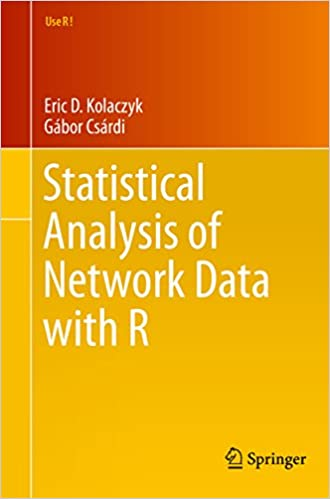

```{r setup, include=FALSE}
knitr::opts_chunk$set(echo = TRUE)
```


# Introducción


Una innovación fundamental en el modelado de datos relacionales es la incorporación de **variables latentes**, que representan **características no observadas** de los vértices. Estas variables, aunque no se observan directamente, desempeñan un papel crucial en la determinación de las **probabilidades de interacción** en el grafo. 

Bajo este enfoque, las entradas de la matriz de adyacencia \(\mathbf{Y} = [y_{i,j}]\), que representa el grafo \(G = (V, E)\), se modelan como condicionalmente independientes, con una distribución Bernoulli dada por:
\[
y_{i,j} \mid \mu, \boldsymbol{\beta}, \mathbf{x}_{i,j}, \boldsymbol{u}_i, \boldsymbol{u}_j  \overset{\text{ind}}{\sim} \textsf{Bernoulli}\left( g\left( \mu + \boldsymbol{\beta}^\textsf{T}\mathbf{x}_{i,j} + \alpha(\boldsymbol{u}_i, \boldsymbol{u}_j) \right) \right),
\]
donde:

- \(g(\cdot)\) es una **función de enlace**, como la función logit inversa, \(\textsf{expit}(x)\), o la función de distribución acumulada de una Normal estándar, \(\Phi(x)\).
- \(\mu\) representa el intercepto.
- \(\boldsymbol{\beta} = (\beta_1, \ldots, \beta_p)\) es un vector de coeficientes asociado con las covariables (variables exógenas) \(\mathbf{x}_{i,j}\).
- \(\mathbf{x}_{i,j} = (x_{i,j,1}, \ldots, x_{i,j,p})\) es un vector de covariables construidas a partir de las características nodales.
- \(\boldsymbol{u}_i = (u_{i,1}, \ldots, u_{i,k})\) es un vector de variables latentes definidas en un **espacio social** de dimensión \(k\).
- \(\alpha(\cdot, \cdot)\) es una función simétrica que captura las interacciones latentes entre los nodos, con posibles formas funcionales:
  1. **Modelo de distancia**: \(\alpha(\boldsymbol{u}_i, \boldsymbol{u}_j) = - \|\boldsymbol{u}_i - \boldsymbol{u}_j\|\).
  2. **Modelo bilineal**: \(\alpha(\boldsymbol{u}_i, \boldsymbol{u}_j) = \boldsymbol{u}_i^\textsf{T} \boldsymbol{u}_j\).
  3. **Modelo factorial**: \(\alpha(\boldsymbol{u}_i, \boldsymbol{u}_j) = \boldsymbol{u}_i^\textsf{T} \mathbf{\Lambda} \boldsymbol{u}_j\), donde \(\mathbf{\Lambda} = \textsf{diag}(\lambda_1, \ldots, \lambda_k)\) es una matriz diagonal de dimensión \(k \times k\).

Para implementar este modelo, es necesario especificar:
1. La dimensión latente \(k\).
2. La distribución de las variables latentes.
3. La forma funcional de \(\alpha(\cdot, \cdot)\).
4. La función de enlace \(g(\cdot)\).

Dado que estos modelos tienen una estructura jerárquica, un **enfoque Bayesiano** resulta natural. Este enfoque permite modelar la incertidumbre y priorizar las distribuciones de los parámetros mediante el uso de **métodos de inferencia basados en cadenas de Markov de Monte Carlo** (*Markov chain Monte Carlo*, MCMC) o **métodos variacionales**, los cuales son herramientas eficaces para explorar la **distribución posterior** de los parámetros y las variables latentes. 


# Modelo de distancia

El modelo de distancia estándar se define como:
\[
y_{i,j} \mid \mu, \boldsymbol{u}_i, \boldsymbol{u}_j \overset{\text{ind}}{\sim} \textsf{Bernoulli}\left( g\left( \mu - \| \boldsymbol{u}_i - \boldsymbol{u}_j \| \right) \right),
\]
donde:

- \( g(x) \) es la función de enlace, típicamente la función logit inversa (\(\textsf{expit}(x)\)):
  \[
  \textsf{expit}(x) = \textsf{logit}^{-1}(x) = \frac{1}{1 + \exp(-x)} = \frac{\exp(x)}{1 + \exp(x)}.
  \]
- \(\mu\) representa el intercepto global y tiene una distribución a priori:
  \[
  \mu \mid \xi, \psi^2 \sim \textsf{N}(\xi, \psi^2),
  \]
  donde \(\xi\) y \(\psi^2\) son los parámetros hiperpriori que controlan la media y la varianza del intercepto.
- \(\boldsymbol{u}_i\) son las posiciones latentes de los nodos en un espacio euclidiano de dimensión \(k\), con la siguiente distribución a priori:
  \[
  \boldsymbol{u}_i \mid \boldsymbol{\mu}, \sigma^2 \overset{\text{ind}}{\sim} \textsf{N}_k(\boldsymbol{\mu}, \sigma^2 \mathbf{I}),
  \]
  donde \(\boldsymbol{\mu}\) es el centro del espacio latente y \(\sigma^2\) es la varianza isotrópica que controla la dispersión de las posiciones.

Este modelo, introducido por Hoff, Raftery y Handcock (2002), es ampliamente utilizado en el análisis de redes sociales para capturar la proximidad latente entre nodos, donde la probabilidad de conexión decrece a medida que aumenta la distancia euclidiana entre sus posiciones latentes.

Hoff, P. D., Raftery, A. E., & Handcock, M. S. (2002). **Latent space approaches to social network analysis.** Journal of the American Statistical Association, 97(460), 1090-1098.


```{r, eval = TRUE, echo=FALSE, out.width="95%", fig.pos = 'H', fig.align = 'center'}
knitr::include_graphics("dist.png")
```


## Datos: Familias Florentinas

Se examinan las **relaciones matrimoniales y comerciales** como mecanismos fundamentales para la **estructuración y consolidación del poder** entre las familias élite de Florencia durante el Renacimiento. 

Mediante un enfoque histórico-social, Padgett explora cómo estas conexiones moldearon la **formación de alianzas estratégicas**, fortalecieron la **perpetuación de jerarquías sociales** y dinamizaron las **relaciones políticas** en un periodo crucial de transformación social y económica.

Padgett, J. F. (1994). **Marriage and Elite Structure in Renaissance Florence, 1282-1500**. Ponencia presentada en la reunión de la Social Science History Association, Atlanta, Georgia.


```{r, fig.width=6, fig.height=6,fig.align='center'}
# librerías
suppressMessages(suppressWarnings(library(igraph)))
suppressMessages(suppressWarnings(library(latentnet)))
# datos
data(florentine, package = "ergm")
flomarriage
class(flomarriage)
# matriz de adyacencia
# remover vértice 12 porque es aislado (distancia Inf)
A <- network::as.matrix.network.adjacency(x = flomarriage)
(index_rm <- which(colSums(A) == 0))
A <- A[-index_rm,-index_rm]
class(A)
# variable exogena: riqueza
wealth <- flomarriage %v% "wealth"
(wealth <- wealth[-index_rm])
# tipo igraph
g <- igraph::graph_from_adjacency_matrix(adjmatrix = A, mode = "undirected")
class(g)
# tipo network 
flomarriage <- network::as.network.matrix(A)
class(flomarriage)
# gráfico
set.seed(42)
plot(g, vertex.size = 1.2*sqrt(wealth), vertex.label = NA, main = "Familias Florentinas")
```


## Ajuste del modelo de distancia clásico 


```{r}
# ajuste del modelo
# d = 2 : dimensión latente bidimensional
# G = 0 : sin factores de agrupamiento
# Ajustar el modelo con parámetros específicos
fit <- ergmm(
  formula = flomarriage ~ euclidean(d = 2, G = 0),
  seed = 42,
  control = ergmm.control(
    burnin = 1000,          # Iteraciones de burn-in
    interval = 10,          # Thinning: guardar 1 muestra cada 5 iteraciones
    sample.size = 5000      # Total de muestras efectivas para inferencia
  )
)
```


```{r}
# resumen del ajuste
summary(fit)
```


## Convergencia


```{r, fig.align='center'}
suppressMessages(suppressWarnings(library(ggplot2)))

# Datos simulados (asegúrate de usar tu propio `fit$sample$lpY`)
x <- c(fit$sample$lpY)
iterations <- 1:length(x)

# Crear un dataframe para ggplot
data <- data.frame(Iteration = iterations, LogLikelihood = x)

# Calcular estadísticas
mean_x <- mean(x)
quantiles_x <- quantile(x, c(0.025, 0.975))

# Generar el gráfico
ggplot(data, aes(x = Iteration, y = LogLikelihood)) +
  geom_point(alpha = 0.3, size = 0.5, color = "black") + # Puntos con transparencia
  geom_hline(yintercept = mean_x, color = "blue", linetype = "dashed", linewidth = 1) + # Línea de la media
  geom_hline(yintercept = quantiles_x, color = "red", linetype = "dotted", linewidth = 1) + # Líneas de los cuantiles
  labs(x = "Iteración", y = "Log-verosimilitud", title = "") +
  theme_minimal() +
  theme(plot.title = element_text(hjust = 0.5)) # Centrar el título si es necesario
```


## Inferencia sobre el intercepto


```{r, fig.align='center'}
# Cargar librerías con supresión de mensajes y advertencias
suppressMessages(suppressWarnings(library(ggplot2)))
suppressMessages(suppressWarnings(library(gridExtra)))

# Datos simulados (reemplaza con fit$sample$beta)
x <- c(fit$sample$beta)
iterations <- 1:length(x)
data_chain <- data.frame(Iteration = iterations, Beta = x)

# Estadísticas
mean_x <- mean(x)
quantiles_x <- quantile(x, c(0.025, 0.975))

# Gráfico de la cadena
p_chain <- ggplot(data_chain, aes(x = Iteration, y = Beta)) +
  geom_point(alpha = 0.3, size = 0.5, color = "black") + # Puntos con transparencia
  geom_hline(yintercept = mean_x, color = "blue", linetype = "dashed", linewidth = 1) + # Línea de la media
  geom_hline(yintercept = quantiles_x, color = "red", linetype = "dotted", linewidth = 1) + # Líneas de los cuantiles
  labs(x = "Iteración", y = expression(beta), title = "Cadena") +
  theme_minimal()

# Histograma de la distribución marginal
data_hist <- data.frame(Beta = x)
p_hist <- ggplot(data_hist, aes(x = Beta)) +
  geom_histogram(aes(y = ..density..), bins = 30, fill = "gray90", color = "gray90") + # Histograma
  geom_vline(xintercept = mean_x, color = "blue", linetype = "dashed", linewidth = 1) + # Línea de la media
  geom_vline(xintercept = quantiles_x, color = "red", linetype = "dotted", linewidth = 1) + # Líneas de los cuantiles
  labs(x = expression(beta), y = "Densidad", title = "Distr. marginal") +
  theme_minimal()

# Combinar los gráficos
grid.arrange(p_chain, p_hist, ncol = 2)
```


```{r}
# media posterior del intercepto
(beta_pm <- mean(fit$sample$beta))
# probabilidad de interacción basal
1/(1 + exp(-beta_pm))
```


## Inferencia sobre las posiciones latentes


```{r, fig.width=12, fig.height=6, fig.align='center'}
# Cargar librerías con supresión de mensajes y advertencias
suppressMessages(suppressWarnings(library(ggplot2)))
suppressMessages(suppressWarnings(library(gridExtra)))
suppressMessages(suppressWarnings(library(MCMCpack)))

# Transformación de Procrustes
B  <- dim(fit$sample$Z)[1]  # Número de muestras MCMC
n  <- dim(fit$sample$Z)[2]  # Número de vértices
d  <- dim(fit$sample$Z)[3]  # Dimensión latente
U0 <- scale(fit$mcmc.mle$Z, scale = TRUE, center = TRUE)
U.array <- array(data = NA, dim = c(B, n, d))
for (b in 1:B) {
  U.array[b,,] <- MCMCpack::procrustes(
    X = scale(fit$sample$Z[b,,], scale = TRUE, center = TRUE),
    Xstar = U0,
    translation = TRUE,
    dilation = TRUE
  )$X.new
}
U.pm <- apply(X = U.array, MARGIN = c(2, 3), FUN = mean)

# Colores (Asegurando que los valores estén en [0, 1])
rr <- atan2(U0[, 2], U0[, 1])
rr <- (rr - min(rr)) / (max(rr) - min(rr))  # Escalar a [0,1]
gg <- 1 - rr  # Complemento
bb <- (U0[, 2]^2 + U0[, 1]^2)
bb <- (bb - min(bb)) / (max(bb))  # Escalar a [0,1]
aa <- 0.4  # Transparencia fija

# Adelgazamiento de la cadena
nthin <- 10
index_thin <- seq(from = nthin, to = B, by = nthin)
thinned_data <- do.call(rbind, lapply(index_thin, function(b) {
  data.frame(
    Dim1 = U.array[b,,1],
    Dim2 = U.array[b,,2],
    Vertex = factor(1:n),
    Color = rgb(rr, gg, bb, alpha = aa)
  )
}))

# Datos para las posiciones promedio
U_pm_df <- data.frame(
  Dim1 = U.pm[, 1],
  Dim2 = U.pm[, 2],
  Vertex = 1:n,
  Color = rgb(rr, gg, bb, alpha = 1)
)

# Primer panel: Con trayectorias y etiquetas
p1 <- ggplot() +
  geom_point(data = thinned_data, aes(x = Dim1, y = Dim2, color = Color), 
             shape = 15, size = 0.8) + # Puntos de trayectorias
  geom_text(data = U_pm_df, aes(x = Dim1, y = Dim2, label = Vertex), 
            color = "black", size = 3, fontface = "bold") + # Etiquetas en negro
  scale_color_identity() +
  labs(
    x = "Dimensión 1", 
    y = "Dimensión 2", 
    title = "Posiciones latentes con trayectorias"
  ) +
  theme_minimal()

# Segundo panel: Solo posiciones promedio con etiquetas pequeñas
p2 <- ggplot() +
  geom_point(data = U_pm_df, aes(x = Dim1, y = Dim2, color = "blue"), 
             size = 3) + # Puntos tradicionales
  geom_text(data = U_pm_df, aes(x = Dim1, y = Dim2, label = Vertex), 
            color = "black", size = 3, vjust = 1.5) + # Etiquetas pequeñas debajo de los puntos
  scale_color_identity() +
  labs(
    x = "Dimensión 1", 
    y = "Dimensión 2", 
    title = "Posiciones promedio con etiquetas"
  ) +
  theme_minimal()

# Combinar gráficos en dos paneles
grid.arrange(p1, p2, ncol = 2)
```


## Inferencia probabilidades de interacción


```{r, fig.width=10, fig.height=5, fig.align='center'}
# función expit
expit <- function(x) 1/(1+exp(-x))
# probabilidades de interacción (media posterior)
Pi <- matrix(0, n, n)
for (b in 1:B) {
  bet <- fit$sample$beta[b]
  for (i in 1:(n-1)) {
    for (j in (i+1):n) {
      lat <- sqrt(sum((fit$sample$Z[b,i,] - fit$sample$Z[b,j,])^2))
      Pi[i,j] <- Pi[j,i] <- Pi[i,j] + expit(bet - lat)/B
    }
  }
}
# gráfico
rownames(A) <- colnames(A) <- 1:n
par(mfrow = c(1,2))
corrplot::corrplot(corr = A,  type = "full", col.lim = c(0,1), method = "shade", addgrid.col = "gray90", tl.col = "black")
corrplot::corrplot(corr = Pi, type = "full", col.lim = c(0,1), method = "shade", addgrid.col = "gray90", tl.col = "black")
```

## Bondad de ajuste


```{r}
# bondad de ajuste
B <- dim(fit$sample$Z)[1]
n <- dim(fit$sample$Z)[2]
d <- dim(fit$sample$Z)[3]
stat <- matrix(NA, B, 6)
set.seed(42)
for (b in 1:B) {
  # intercepto
  bet <- fit$sample$beta[b]
  # simular datos
  Ar  <- matrix(0, n, n)
  for (i in 1:(n-1)) {
    for (j in (i+1):n){
      lat <- sqrt(sum((fit$sample$Z[b,i,] - fit$sample$Z[b,j,])^2))
      Ar[i,j] <- Ar[j,i] <- rbinom(n = 1, size = 1, prob = expit(bet - lat))
    }
  }
  gr <- igraph::graph_from_adjacency_matrix(adjmatrix = Ar, mode = "undirected")
  # calcular estadísticos
  stat[b,1] <- igraph::edge_density(graph = gr, loops = F)
  stat[b,2] <- igraph::transitivity(graph = gr, type = "global")
  stat[b,3] <- igraph::assortativity_degree(graph = gr, directed = F)
  stat[b,4] <- igraph::mean_distance(graph = gr, directed = F)
  stat[b,5] <- mean(igraph::degree(graph = gr))
  stat[b,6] <- sd(igraph::degree(graph = gr))
}
```


```{r, fig.align='center'}
# Cargar librerías con supresión de mensajes y advertencias
suppressMessages(suppressWarnings(library(ggplot2)))
suppressMessages(suppressWarnings(library(gridExtra)))

# valores observados
dens_obs <- igraph::edge_density(graph = g, loops = F)
tran_obs <- igraph::transitivity(graph = g, type = "global")
asso_obs <- igraph::assortativity_degree(graph = g, directed = F)
mdis_obs <- igraph::mean_distance(graph = g, directed = F)
mdeg_obs <- mean(igraph::degree(graph = g))
sdeg_obs <- sd(igraph::degree(graph = g))

# Crear un dataframe con las estadísticas simuladas
stat_df <- data.frame(
  Densidad = stat[,1],
  Transitividad = stat[,2],
  Asortatividad = stat[,3],
  DistanciaProm = stat[,4],
  GradoProm = stat[,5],
  GradoDE = stat[,6]
)

# Crear un dataframe con los valores observados
obs_values <- data.frame(
  Estadístico = c("Densidad", "Transitividad", "Asortatividad", "DistanciaProm", "GradoProm", "GradoDE"),
  Observado = c(dens_obs, tran_obs, asso_obs, mdis_obs, mdeg_obs, sdeg_obs)
)

# Calcular intervalos de confianza
ci_values <- data.frame(
  Estadístico = c("Densidad", "Transitividad", "Asortatividad", "DistanciaProm", "GradoProm", "GradoDE"),
  CI_Lower = c(quantile(stat[,1], 0.025), quantile(stat[,2], 0.025), quantile(stat[,3], 0.025),
               quantile(stat[,4], 0.025), quantile(stat[,5], 0.025), quantile(stat[,6], 0.025)),
  CI_Upper = c(quantile(stat[,1], 0.975), quantile(stat[,2], 0.975), quantile(stat[,3], 0.975),
               quantile(stat[,4], 0.975), quantile(stat[,5], 0.975), quantile(stat[,6], 0.975))
)

# Función para crear cada histograma
create_histogram <- function(data, column, obs, ci_lower, ci_upper, x_label, title) {
  ggplot(data, aes(x = .data[[column]])) +
    geom_histogram(aes(y = ..density..), bins = 30, fill = "gray90", color = "gray90") +
    geom_vline(xintercept = obs, color = "blue", linetype = "dashed", linewidth = 1) + # Línea del valor observado
    geom_vline(xintercept = c(ci_lower, ci_upper), color = "red", linetype = "dotted", linewidth = 1) + # Líneas IC
    labs(x = x_label, y = "Densidad", title = title) +
    theme_minimal()
}

# Crear gráficos individuales
p1 <- create_histogram(stat_df, "Densidad", dens_obs, ci_values$CI_Lower[1], ci_values$CI_Upper[1], "Densidad", "Densidad")
p2 <- create_histogram(stat_df, "Transitividad", tran_obs, ci_values$CI_Lower[2], ci_values$CI_Upper[2], "Transitividad", "Transitividad")
p3 <- create_histogram(stat_df, "Asortatividad", asso_obs, ci_values$CI_Lower[3], ci_values$CI_Upper[3], "Asortatividad", "Asortatividad")
p4 <- create_histogram(stat_df, "DistanciaProm", mdis_obs, ci_values$CI_Lower[4], ci_values$CI_Upper[4], "Distancia prom.", "Distancia promedio")
p5 <- create_histogram(stat_df, "GradoProm", mdeg_obs, ci_values$CI_Lower[5], ci_values$CI_Upper[5], "Grado prom.", "Grado promedio")
p6 <- create_histogram(stat_df, "GradoDE", sdeg_obs, ci_values$CI_Lower[6], ci_values$CI_Upper[6], "Grado DE", "Grado DE")

# Combinar gráficos en un diseño de 2x3
grid.arrange(p1, p2, p3, p4, p5, p6, ncol = 3)

```

# Modelo de distancia clásico con covariables

El modelo que incorpora covariables y proximidad latente se define como:

\[
y_{i,j} \mid \mu, \boldsymbol{\beta}, \mathbf{x}_{i,j}, \boldsymbol{u}_i, \boldsymbol{u}_j \overset{\text{ind}}{\sim} \textsf{Bernoulli}\left( \textsf{expit}\left( \mu + \boldsymbol{\beta}^\textsf{T} \mathbf{x}_{i,j} - \| \boldsymbol{u}_i - \boldsymbol{u}_j \| \right) \right),
\]

donde:

- **\( \textsf{expit}(x) \)**: Es la **función logit inversa**, que transforma un valor real en una probabilidad en el rango \([0,1]\):
  \[
  \textsf{expit}(x) = \textsf{logit}^{-1}(x) = \frac{1}{1 + \exp(-x)} = \frac{\exp(x)}{1 + \exp(x)}.
  \]
- **\(\mu\)**: Representa el **intercepto global**, modelado a priori como una distribución normal:
  \[
  \mu \mid \xi, \psi^2 \sim \textsf{N}(\xi, \psi^2),
  \]
  donde \(\xi\) y \(\psi^2\) son hiperparámetros que controlan la media y la varianza del intercepto.
- **\(\boldsymbol{\beta}\)**: Es un vector de **coeficientes asociados a las covariables** \(\mathbf{x}_{i,j}\). Cada componente sigue una distribución normal a priori:
  \[
  \beta_\ell \mid \xi_\ell, \psi_\ell^2 \sim \textsf{N}(\xi_\ell, \psi_\ell^2), \quad \ell = 1, \ldots, p,
  \]
  donde \(\xi_\ell\) y \(\psi_\ell^2\) son hiperparámetros específicos de cada coeficiente.
- **\(\boldsymbol{u}_i\)**: Representa las **posiciones latentes de los nodos** en un espacio euclidiano de dimensión \(k\), con la siguiente distribución a priori:
  \[
  \boldsymbol{u}_i \mid \boldsymbol{\mu}, \sigma^2 \overset{\text{ind}}{\sim} \textsf{N}_k(\boldsymbol{\mu}, \sigma^2 \mathbf{I}),
  \]
  donde \(\boldsymbol{\mu}\) es el centro del espacio latente y \(\sigma^2\) controla la dispersión isotrópica de las posiciones.

Este modelo, propuesto por Hoff, Raftery y Handcock (2002), combina la **representación de espacio latente** con efectos de **covariables exógenas**, permitiendo capturar la **probabilidad de interacción** entre nodos como una combinación de:

1. **Efectos globales** (\(\mu\)).
2. **Efectos de las covariables** (\(\boldsymbol{\beta}^\textsf{T} \mathbf{x}_{i,j}\)).
3. **Proximidad latente** (\(-\| \boldsymbol{u}_i - \boldsymbol{u}_j \|\)).

Es ampliamente utilizado para modelar redes sociales donde la **distancia latente** y las **características de los nodos** influyen conjuntamente en las conexiones.

Hoff, P. D., Raftery, A. E., & Handcock, M. S. (2002). **Latent space approaches to social network analysis.** Journal of the American Statistical Association, 97(460), 1090-1098.

## Datos: Familias Florentinas (cont.)


```{r, fig.width=6, fig.height=6}
# librerias
suppressMessages(suppressWarnings(library(igraph)))
suppressMessages(suppressWarnings(library(latentnet)))
# datos
data(florentine, package = "ergm")
flomarriage
# clase
class(flomarriage)
# matriz de adyacencia
# remover vertice 12 porque es ailado (distancia Inf)
A <- network::as.matrix.network.adjacency(x = flomarriage)
(index_rm <- which(colSums(A) == 0))
A <- A[-index_rm,-index_rm]
class(A)
# variable exogena: riqueza
wealth <- flomarriage %v% "wealth"
(wealth <- wealth[-index_rm])
# tipo igraph
g <- igraph::graph_from_adjacency_matrix(adjmatrix = A, mode = "undirected")
class(g)
# tipo network 
flomarriage <- network::as.network.matrix(A)
class(flomarriage)
```

## Ajuste del modelo


```{r}
# Cargar librerías con supresión de mensajes y advertencias
suppressMessages(suppressWarnings(library(latentnet)))

# Construir las covariables
x <- abs(outer(X = wealth, Y = wealth, FUN = "-"))

# Ajustar el modelo con los mismos parámetros de configuración
fit <- ergmm(
  formula = flomarriage ~ euclidean(d = 2, G = 0) + edgecov(x), # Modelo con covariables
  seed = 42,                                                   # Fijar semilla para reproducibilidad
  control = ergmm.control(
    burnin = 1000,          # Iteraciones de burn-in
    interval = 10,          # Thinning: guardar 1 muestra cada 10 iteraciones
    sample.size = 5000      # Total de muestras efectivas para inferencia
  )
)
```


```{r}
# resumen del ajuste
summary(fit)
```


## Inferencia sobre los coeficientes


```{r, fig.align='center'}
# Cargar librerías con supresión de mensajes y advertencias
suppressMessages(suppressWarnings(library(ggplot2)))
suppressMessages(suppressWarnings(library(gridExtra)))

# Datos de la cadena (reemplaza con fit$sample$beta[,2])
x <- c(fit$sample$beta[,2])
iterations <- 1:length(x)
data_chain <- data.frame(Iteration = iterations, Beta = x)

# Estadísticas
mean_x <- mean(x)
quantiles_x <- quantile(x, c(0.025, 0.975))

# Gráfico de la cadena con puntos
p_chain <- ggplot(data_chain, aes(x = Iteration, y = Beta)) +
  geom_point(alpha = 0.3, size = 0.5, color = "black") + # Puntos con transparencia
  geom_hline(yintercept = mean_x, color = "blue", linetype = "dashed", linewidth = 1) + # Línea de la media
  geom_hline(yintercept = quantiles_x, color = "red", linetype = "dotted", linewidth = 1) + # Líneas de los cuantiles
  labs(x = "Iteración", y = expression(beta), title = "Cadena") +
  theme_minimal()

# Histograma de la distribución marginal
data_hist <- data.frame(Beta = x)
p_hist <- ggplot(data_hist, aes(x = Beta)) +
  geom_histogram(aes(y = ..density..), bins = 30, fill = "gray90", color = "gray90") + # Histograma
  geom_vline(xintercept = mean_x, color = "blue", linetype = "dashed", linewidth = 1) + # Línea de la media
  geom_vline(xintercept = quantiles_x, color = "red", linetype = "dotted", linewidth = 1) + # Líneas de los cuantiles
  labs(x = expression(beta), y = "Densidad", title = "Distr. marginal") +
  theme_minimal()

# Combinar los gráficos
grid.arrange(p_chain, p_hist, ncol = 2)
```


```{r}
# Cargar librerías con supresión de mensajes y advertencias
suppressMessages(suppressWarnings(library(dplyr)))
suppressMessages(suppressWarnings(library(kableExtra)))

# Extraer las muestras
mu_samples <- fit$sample$beta[,1]
beta_samples <- fit$sample$beta[,2]

# Calcular estadísticas
results <- data.frame(
  Parameter = c("mu", "beta"),
  Mean = c(mean(mu_samples), mean(beta_samples)),
  SD = c(sd(mu_samples), sd(beta_samples)),
  `2.5%` = c(quantile(mu_samples, 0.025), quantile(beta_samples, 0.025)),
  `97.5%` = c(quantile(mu_samples, 0.975), quantile(beta_samples, 0.975))
)

# Crear la tabla estilizada
results %>%
  kable(format = "html", digits = 3, col.names = c("Parameter", "Media", "Desviación", "L. Inferior", "L. Superior")) %>%
  kable_styling(full_width = FALSE, bootstrap_options = c("striped", "hover", "condensed", "responsive")) %>%
  add_header_above(c(" " = 1, "Inferencia posterior" = 4))
```


# Modelo de distancia con agrupaciones


El modelo de distancia con agrupaciones se define como:

\[
y_{i,j} \mid \mu, \boldsymbol{u}_i, \boldsymbol{u}_j \overset{\text{ind}}{\sim} \textsf{Bernoulli}\left( \textsf{expit}\left( \mu - \| \boldsymbol{u}_i - \boldsymbol{u}_j \| \right) \right),
\]

donde:

- **\(\textsf{expit}(x)\)**: Es la **función logit inversa**, que transforma un valor real en una probabilidad en el rango \([0,1]\):
  \[
  \textsf{expit}(x) = \textsf{logit}^{-1}(x) = \frac{1}{1 + \exp(-x)} = \frac{\exp(x)}{1 + \exp(x)}.
  \]
- **\(\mu\)**: Representa el **intercepto global**, modelado a priori con una distribución normal:
  \[
  \mu \mid \xi, \psi^2 \sim \textsf{N}(\xi, \psi^2),
  \]
  donde \(\xi\) y \(\psi^2\) son hiperparámetros que controlan la media y la varianza del intercepto.
- **\(\boldsymbol{u}_i\)**: Denota las **posiciones latentes de los nodos** en un espacio euclidiano de dimensión \(k\). Estas posiciones provienen de una **mezcla de distribuciones normales multivariadas**:
  \[
  \boldsymbol{u}_i \mid \{\lambda_g\}, \{\boldsymbol{\mu}_g\}, \{\sigma_g^2\} \overset{\text{iid}}{\sim} \sum_{g=1}^G \lambda_g\, \textsf{N}_k(\boldsymbol{\mu}_g, \sigma_g^2 \mathbf{I}),
  \]
  donde:
  1. **\(G\)**: Es el **número de grupos latentes**.
  2. **\(\lambda_g\)**: Son los **pesos de la mezcla**, que cumplen \(\sum_{g=1}^G \lambda_g = 1\).
  3. **\(\boldsymbol{\mu}_g\)**: Son los **centros** de los grupos en el espacio latente.
  4. **\(\sigma_g^2\)**: Controla la **dispersión dentro de cada grupo**.

Este modelo, propuesto por Krivitsky, Handcock, Raftery y Hoff (2009), introduce **agrupaciones latentes** mediante una mezcla de distribuciones normales. Esto permite capturar patrones de:

1. **Heterogeneidad estructural**, como la agrupación de nodos en comunidades latentes.
2. **Homofilia**, que refleja la tendencia de nodos similares a conectarse.
3. **Efectos de clústeres**, representando comunidades naturales dentro de la red.

Es especialmente útil para modelar redes sociales donde las interacciones están influenciadas por la **proximidad latente** y las **estructuras de agrupamiento**.

Krivitsky, P. N., Handcock, M. S., Raftery, A. E., & Hoff, P. D. (2009). **Representing degree distributions, clustering, and homophily in social networks with latent cluster random effects models.** *Social Networks, 31*(3), 204-213.


## Datos: Sampson 


Sampson (1969) documentó las **interacciones sociales** entre un grupo de monjes durante su residencia en un claustro, con un interés particular en las **relaciones de afecto positivo**.  

En el estudio, cada monje seleccionó sus tres principales opciones (o cuatro, en caso de empate) de relaciones de "agrado". Se considera que existe una **arista dirigida** del monje A al monje B si A incluyó a B entre sus principales elecciones. Este enfoque permite capturar la **estructura de las preferencias sociales** dentro del grupo.  

Sampson, S. F. (1968). **A novitiate in a period of change: An experimental and case study of relationships**. Tesis doctoral no publicada, Departamento de Sociología, Cornell University.


```{r}
# datos
data(sampson)
samplike
class(samplike)
# matriz de adyacencia
# no hay vértices conectados
A <- network::as.matrix.network.adjacency(x = samplike)
class(A)
# tipo igraph
g <- igraph::graph_from_adjacency_matrix(adjmatrix = A, mode = "directed")
class(g)
# gráfico
set.seed(42)
plot(g, vertex.size = 10, vertex.label = NA, edge.arrow.size = 0.5, main = "Monjes")
```

## Ajuste del modelo


```{r}
# ajuste del modelo para varios valores de G
fit1 <- ergmm(samplike ~ euclidean(d = 2, G = 1))
fit2 <- ergmm(samplike ~ euclidean(d = 2, G = 2))
fit3 <- ergmm(samplike ~ euclidean(d = 2, G = 3))
fit4 <- ergmm(samplike ~ euclidean(d = 2, G = 4))
```


## Selección del modelo


```{r, fig.width=6, fig.height=6, fig.align='center'}
# modelos
fits <- list(fit1, fit2, fit3, fit4)

# calcular BICs
bics <- reshape(as.data.frame(t(sapply(fits, function(x) c(G = x$model$G, unlist(bic.ergmm(x))[c("Y","Z","overall")])))),
                list(c("Y","Z","overall")),
                idvar = "G",
                v.names = "BIC",
                timevar = "Component",
                times = c("likelihood","clustering","overall"),
                direction = "long")
bics
# grafico de BIC vs no.de clusters
with(bics, interaction.plot(G, Component, BIC, type = "b", xlab = "Clusters", ylab = "BIC"))
# G optimo
bestG <- with(bics[bics$Component == "overall",], G[which.min(BIC)])
bestG
# resumen del modelo para G = 3
summary(fit3)
```


## Inferencia sobre las posiciones latentes


```{r, fig.width=6, fig.height=6, fig.align='center'}
# grafico densidad variables latentes
plot(fit3, what = "density")
```


```{r, fig.width=6, fig.height=6, fig.align='center'}
# grafico posiciones latentes
plot(fit3, what = "pmean", print.formula = F, main = "Media post. posiciones latentes")
```


```{r, fig.width=6, fig.height=6, fig.align='center'}
# gráfico posiciones latentes
plot(fit3, pie = TRUE, vertex.cex = 3, print.formula = F, main = "Media post. posiciones latentes")
```


```{r}
# asignacion de los clusters
fit3$mcmc.mle$Z.K
```

# Referencias {-}

```{r, eval = TRUE, echo=FALSE, out.width="25%", fig.pos = 'H', fig.align = 'center'}

```


